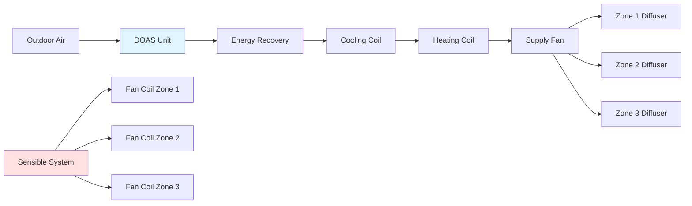
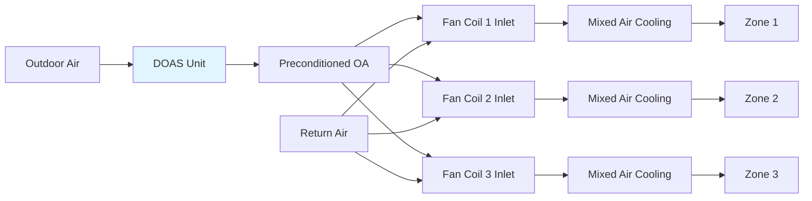
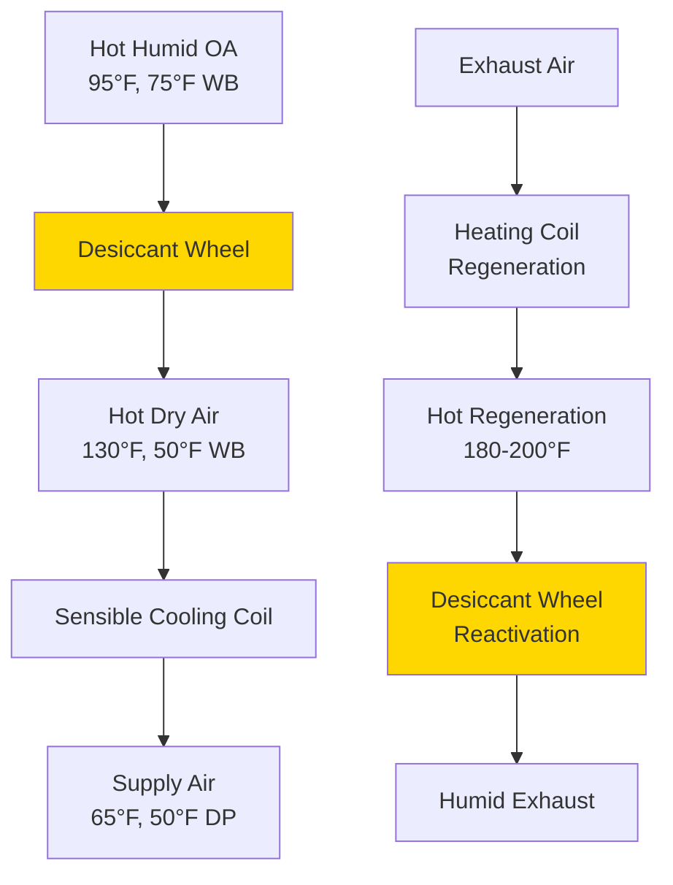

## Fundamental Concept

Dedicated Outdoor Air Systems (DOAS) represent a paradigm shift in HVAC design by **decoupling ventilation air treatment from space sensible cooling**. Unlike conventional systems where outdoor air mixes with return air before conditioning, DOAS handles 100% outdoor air in a separate dedicated unit, delivering pretreated ventilation air directly to spaces or to terminal units.

The core principle: **one system handles latent loads and ventilation (DOAS), while separate systems address sensible cooling loads** (radiant panels, chilled beams, fan coils, or variable refrigerant flow systems).

## ASHRAE 62.1 Compliance

ASHRAE Standard 62.1 requires minimum ventilation rates based on occupancy and floor area. DOAS simplifies compliance by:

- Delivering consistent ventilation airflow regardless of space load conditions
- Eliminating variable outdoor air fraction issues inherent in VAV systems
- Enabling direct measurement and verification of outdoor air delivery
- Maintaining ventilation effectiveness (Ez) more reliably

**Ventilation requirement calculation per ASHRAE 62.1:**

```
Vbz = RpPz + RaAz
```

Where:
- Vbz = breathing zone outdoor airflow (cfm)
- Rp = people outdoor air rate (cfm/person)
- Ra = area outdoor air rate (cfm/ft²)
- Pz = zone population
- Az = zone floor area (ft²)

For a typical office space (Rp = 5 cfm/person, Ra = 0.06 cfm/ft²):
- 3,000 ft² space with 15 people
- Vbz = (5 × 15) + (0.06 × 3,000) = 75 + 180 = **255 cfm**

## System Configurations

### Parallel Configuration

In parallel DOAS, ventilation air delivers **directly to spaces**, independent of terminal units.



**Advantages:**
- True decoupling of ventilation and sensible loads
- Terminal units handle only sensible loads (smaller equipment)
- Simplified terminal unit controls
- Enhanced humidity control at DOAS unit

**Disadvantages:**
- Requires separate ductwork distribution for DOAS
- Higher initial installation cost
- More ceiling space for dual distribution systems

### Series Configuration

In series DOAS, ventilation air delivers **to terminal unit inlets**, mixing with recirculated air.



**Advantages:**
- Single ductwork distribution system
- Lower installation cost
- Less ceiling space required
- Simplified architecture

**Disadvantages:**
- Terminal units must handle combined ventilation and sensible loads (larger equipment)
- Less precise humidity control at zone level
- Potential for mixing losses

## Dehumidification Strategies

### Conventional Cooling Coil Approach

DOAS cooling coils operate at **lower apparatus dew point (ADP) temperatures** than conventional systems to achieve deeper dehumidification.

**Latent cooling capacity:**

```
QL = 4,840 × cfm × Δω
```

Where:
- QL = latent cooling capacity (Btu/hr)
- cfm = airflow rate
- Δω = humidity ratio difference (lbw/lbda)
- 4,840 = conversion constant (60 min/hr × 0.075 lbda/ft³ × 1,076 Btu/lbw)

**Example calculation:**
- Outdoor air: 95°F DB, 75°F WB (ω = 0.0146 lbw/lbda)
- Target supply: 55°F DB, 95% RH (ω = 0.0095 lbw/lbda)
- Airflow: 2,000 cfm

```
QL = 4,840 × 2,000 × (0.0146 - 0.0095)
QL = 4,840 × 2,000 × 0.0051
QL = 49,368 Btu/hr (4.1 tons latent)
```

**Sensible cooling capacity:**

```
QS = 1.08 × cfm × ΔT
QS = 1.08 × 2,000 × (95 - 55)
QS = 86,400 Btu/hr (7.2 tons sensible)
```

**Total cooling: 135,768 Btu/hr (11.3 tons)**

**Sensible Heat Ratio (SHR):**

```
SHR = QS / (QS + QL) = 86,400 / 135,768 = 0.64
```

This low SHR (typically 0.55-0.70 for DOAS) contrasts with conventional systems (SHR 0.75-0.85), demonstrating DOAS focus on latent removal.

### Desiccant Dehumidification

For extreme humidity conditions or when very low dew points are required, **desiccant wheels** provide chemical dehumidification without overcooling.



**Desiccant wheel performance:**
- Moisture removal: 40-60 grains/lb (0.006-0.009 lbw/lbda)
- Regeneration temperature: 180-220°F
- Energy recovery potential: 50-70% sensible effectiveness
- Pressure drop: 0.4-0.8 in. w.g.

## Energy Recovery Integration

Energy recovery dramatically reduces DOAS operating costs by preconditiong outdoor air with exhaust air energy.

**Total effectiveness:**

```
ηt = (h1 - h2) / (h1 - h4)
```

Where:
- h1 = entering outdoor air enthalpy
- h2 = leaving outdoor air enthalpy (after recovery)
- h4 = entering exhaust air enthalpy

**Example with enthalpy wheel (75% total effectiveness):**

Summer condition:
- Outdoor air: 95°F, 75°F WB (h = 38.3 Btu/lb)
- Exhaust air: 75°F, 50% RH (h = 28.1 Btu/lb)
- After recovery: h2 = 38.3 - 0.75(38.3 - 28.1) = **30.6 Btu/lb**

This represents **precooling from 95°F to approximately 78°F** before mechanical cooling.

**Annual energy savings:**

```
Savings = 4.5 × cfm × Δh × hours
```

For 2,000 cfm, 7.7 Btu/lb enthalpy reduction, 3,000 cooling hours:
```
Savings = 4.5 × 2,000 × 7.7 × 3,000 = 207,900,000 Btu/year
```

At $0.12/kWh (0.8 COP): **$9,100 annual savings**

## Neutral vs. Cold Supply Air

### Neutral Supply Strategy (55-65°F)

Delivers air near space temperature to **minimize sensible impact** on zones:

- Reduces terminal unit reheat requirements
- Allows smaller terminal units (sensible-only sizing)
- Optimal for radiant cooling systems
- Typical supply: 60-65°F in cooling mode

### Cold Supply Strategy (48-55°F)

Delivers cold air to **provide both latent and partial sensible cooling**:

- Reduces terminal unit cooling capacity requirements
- May eliminate some terminal units in low-load spaces
- Requires reheat for ventilation-dominated zones
- Typical supply: 50-55°F

**Trade-off analysis:** Neutral supply maximizes decoupling benefits but requires full-capacity sensible systems. Cold supply provides sensible cooling assistance but increases reheat penalties and defeats pure decoupling advantages.

## Load Calculation Methodology

### DOAS Sizing Components

**1. Ventilation airflow (ASHRAE 62.1):**
- Calculate per space type and occupancy
- Sum all zones served by DOAS unit
- Add distribution losses if applicable

**2. Latent load:**
```
QL = 4,840 × cfm × (ωOA - ωsupply)
```

**3. Sensible load:**
```
QS = 1.08 × cfm × (TOA - Tsupply)
```

**4. Dehumidification capacity check:**

Verify coil ADP and contact factor can achieve target humidity:
```
Tsupply = Tcoil,ADP + CF × (Tmixed - Tcoil,ADP)
```

Where CF = coil contact factor (typically 0.85-0.95)

### Design Day Example

**Project:** 20,000 ft² office building, 100 occupants
**Location:** Atlanta, GA (Summer design: 94°F DB, 74°F WB)

**Step 1: Ventilation requirement**
```
V = (5 cfm/person × 100) + (0.06 cfm/ft² × 20,000)
V = 500 + 1,200 = 1,700 cfm
```

**Step 2: Target supply conditions**
- Supply: 55°F, 90% RH (ω = 0.0085 lbw/lbda)
- Outdoor: 94°F, 74°F WB (ω = 0.0142 lbw/lbda)

**Step 3: Cooling loads**

Latent:
```
QL = 4,840 × 1,700 × (0.0142 - 0.0085) = 46,903 Btu/hr
```

Sensible:
```
QS = 1.08 × 1,700 × (94 - 55) = 71,604 Btu/hr
```

**Total: 118,507 Btu/hr (9.9 tons)**

With 70% effective energy recovery:
```
Net cooling = 118,507 × (1 - 0.70) = 35,552 Btu/hr (3.0 tons)
```

**DOAS equipment selection: 3-ton DX unit with enthalpy wheel**

## Control Strategies

**Supply air temperature reset:**
- Monitor zone humidity levels
- Reset supply temperature between 50-65°F based on dehumidification demand
- Prevents overcooling when latent loads are low

**Demand-based ventilation:**
- Modulate outdoor air based on CO₂ sensors (if occupancy varies)
- Maintain minimum code-required ventilation
- Reduces energy during unoccupied or low-occupancy periods

**Bypass control:**
- During mild conditions, bypass cooling coil
- Use energy recovery only for preconditioning
- Economizer operation when outdoor conditions favorable

## Benefits Summary

| Benefit Category | Quantified Impact |
|-----------------|-------------------|
| IAQ consistency | 100% outdoor air delivery, no VAV turndown issues |
| Humidity control | Space RH maintained 40-60% vs. 35-70% conventional |
| Energy savings | 20-40% reduction in HVAC energy vs. constant volume |
| Equipment downsizing | Terminal units 30-50% smaller (sensible-only) |
| Maintenance | Centralized OA treatment, simplified zone equipment |
| Comfort | Elimination of cold drafts, improved distribution |

DOAS architecture provides superior ventilation performance, precise humidity control, and significant energy savings through intelligent decoupling of ventilation from sensible cooling loads. Proper design requires careful analysis of climate conditions, load profiles, and integration with sensible cooling systems to maximize benefits.

---

**File:** /Users/evgenygantman/Documents/github/gantmane/hvac/content/ventilation-indoor-air-quality/ventilation-systems/dedicated-outdoor-air-systems/_index.md
