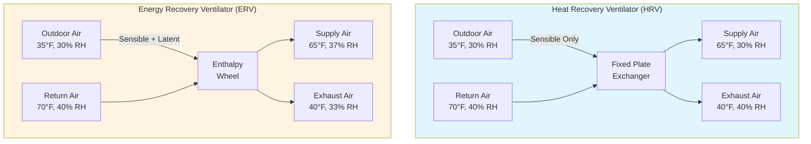
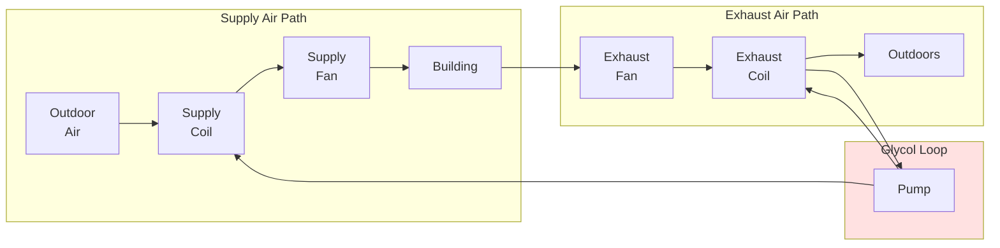

Energy recovery ventilation (ERV) systems recover thermal energy from exhaust airstreams to precondition incoming outdoor air, significantly reducing HVAC energy consumption. Understanding the physics of heat and moisture transfer across different exchanger types enables optimal system selection for specific climate conditions.

## Sensible vs Total Energy Recovery

**Heat Recovery Ventilators (HRV)** transfer only sensible heat between airstreams through a conductive barrier. Temperature changes occur, but humidity remains unaffected. The sensible effectiveness (εs) quantifies performance:

$$\varepsilon_s = \frac{T_{supply} - T_{outdoor}}{T_{exhaust} - T_{outdoor}}$$

Where:
- Tsupply = supply air temperature leaving exchanger (°F)
- Texhaust = building exhaust air temperature (°F)
- Toutdoor = outdoor air temperature entering exchanger (°F)

**Energy Recovery Ventilators (ERV)** transfer both sensible heat and latent heat (moisture). Total effectiveness (εt) accounts for enthalpy transfer:

$$\varepsilon_t = \frac{h_{supply} - h_{outdoor}}{h_{exhaust} - h_{outdoor}}$$

Where h represents specific enthalpy (BTU/lb dry air).

Latent effectiveness (εl) isolates moisture transfer performance:

$$\varepsilon_l = \frac{W_{supply} - W_{outdoor}}{W_{exhaust} - W_{outdoor}}$$

Where W is humidity ratio (lb moisture/lb dry air).

## Effectiveness and NTU Method

The Number of Transfer Units (NTU) provides dimensionless heat exchanger analysis. For counterflow configurations with balanced airflows:

$$NTU = \frac{UA}{\dot{m}_{min} c_p}$$

Where:
- U = overall heat transfer coefficient (BTU/hr·ft²·°F)
- A = heat transfer surface area (ft²)
- ṁmin = minimum mass flow rate between airstreams (lb/hr)
- cp = specific heat of air (0.24 BTU/lb·°F)

For counterflow exchangers with balanced flows (C* = 1):

$$\varepsilon_s = \frac{NTU}{1 + NTU}$$

For crossflow configurations, effectiveness depends on flow arrangement. Unmixed-unmixed crossflow:

$$\varepsilon_s = 1 - \exp\left[\frac{NTU^{0.22}}{C^*}\left(\exp(-C^* \cdot NTU^{0.78}) - 1\right)\right]$$

Where C* = ratio of minimum to maximum heat capacity rate (dimensionless).

## Energy Recovery Technologies

### Fixed Plate Heat Exchangers

Aluminum or polymer plates separate airstreams in counterflow or crossflow arrangements. Sensible effectiveness ranges from 50-85% depending on configuration.

**Advantages:**
- No moving parts, minimal maintenance
- Zero cross-contamination between airstreams
- Compact footprint
- Low pressure drop (0.3-0.8" w.c.)

**Limitations:**
- Sensible-only recovery (no moisture transfer)
- Fixed geometry limits turndown capability
- Frost formation in cold climates requires defrost strategies

### Enthalpy Wheels (Rotary Heat Exchangers)

Rotating desiccant-coated wheel transfers heat and moisture between airstreams. Typical effectiveness: 70-85% sensible, 60-75% latent.

**Advantages:**
- Simultaneous sensible and latent recovery
- High effectiveness across operating range
- Self-cleaning action reduces fouling

**Limitations:**
- Moving parts require maintenance (bearings, belts, motor)
- Potential cross-contamination (1-3% carryover)
- Higher pressure drop (0.5-1.2" w.c.)
- Requires purge section to minimize cross-leakage

### Run-Around Coil Systems

Glycol solution circulates between exhaust and supply air coils, transferring sensible heat. Effectiveness typically 45-65%.

**Advantages:**
- Exhaust and supply ducts need not be adjacent
- No cross-contamination
- Minimal freeze risk with glycol solution
- Individual coil replacement possible

**Limitations:**
- Lowest effectiveness of common technologies
- Sensible-only recovery
- Pump energy penalty
- Glycol leakage potential requires monitoring

## ASHRAE 90.1 Requirements

ASHRAE 90.1 Section 6.5.6.1 mandates energy recovery for systems meeting specific criteria:

| Climate Zone | Design Supply Airflow Threshold | % Outdoor Air |
|--------------|--------------------------------|---------------|
| 3B, 3C, 4B, 4C, 5B, 5C | ≥ 5,000 cfm | ≥ 70% |
| 1B, 2B, 3A, 4A, 5A, 6A | ≥ 5,000 cfm | ≥ 70% |
| 6B, 7, 8 | ≥ 5,000 cfm | ≥ 50% |

Minimum energy recovery ratio: 50% (enthalpy recovery ratio per AHRI 1060).

Exceptions include:
- Laboratory fume hood systems
- Systems serving spaces with hazardous exhaust
- Commercial kitchen exhaust
- Dehumidification applications in humid climates

## Climate-Specific Selection

### Cold Climates (Zones 5-8)

**Recommendation:** Fixed plate HRV or enthalpy wheel with defrost control.

Cold outdoor air creates frost formation risk when exhaust air moisture condenses and freezes on exchanger surfaces. Defrost strategies include:
- Recirculation defrost (bypass outdoor air temporarily)
- Preheat coil (raise entering air temperature above 20°F)
- Wheel speed modulation (reduce exposure time)

Sensible recovery priority exceeds latent recovery in heating-dominated climates. Winter infiltration introduces dry outdoor air, making moisture recovery less valuable.

### Hot-Humid Climates (Zones 1-2)

**Recommendation:** Enthalpy wheel ERV with high latent effectiveness.

Summer outdoor air carries substantial moisture load. Latent cooling comprises 30-50% of total cooling load. Moisture recovery from exhaust air reduces compressor runtime and improves dehumidification.

Target specifications:
- Latent effectiveness ≥ 60%
- Total effectiveness ≥ 70%
- Desiccant coating for moisture adsorption

### Mixed Climates (Zones 3-4)

**Recommendation:** Enthalpy wheel ERV for year-round benefits.

Both heating and cooling seasons present significant loads. Total energy recovery captures value in all operating modes:
- Winter: recover sensible heat and humidification energy
- Summer: recover sensible cooling and dehumidification energy
- Shoulder seasons: free cooling via economizer integration

## Performance Calculations

**Example:** Calculate energy savings for 5,000 cfm ERV in mixed climate.

Given conditions:
- Outdoor air: 95°F DB, 75°F WB (h = 38.2 BTU/lb)
- Exhaust air: 75°F DB, 50% RH (h = 28.1 BTU/lb)
- Total effectiveness: 75%

Supply air enthalpy after ERV:

$$h_{supply} = h_{outdoor} - \varepsilon_t(h_{outdoor} - h_{exhaust})$$

$$h_{supply} = 38.2 - 0.75(38.2 - 28.1) = 30.6 \text{ BTU/lb}$$

Mass flow rate (ρ = 0.075 lb/ft³):

$$\dot{m} = 5000 \times 60 \times 0.075 = 22,500 \text{ lb/hr}$$

Energy recovery rate:

$$\dot{Q}_{recovered} = \dot{m}(h_{outdoor} - h_{supply}) = 22,500(38.2 - 30.6) = 171,000 \text{ BTU/hr}$$

Annual cooling energy savings depends on operating hours and utility rates, but this 14.25-ton reduction in cooling load demonstrates substantial mechanical system downsizing potential.

## System Integration Considerations

Energy recovery systems interact with economizer controls per ASHRAE 90.1 Section 6.5.1. When outdoor air conditions favor free cooling (enthalpy or dry-bulb economizer mode), the ERV should:

1. **Bypass mode:** Dampers redirect airstreams around exchanger
2. **Wheel stop:** Enthalpy wheels cease rotation to prevent heat addition
3. **Run-around pump off:** Disable glycol circulation

Proper control sequencing prevents energy recovery from opposing economizer operation. Integrated economizer-ERV controls maximize annual energy savings by selecting optimal operating mode for current conditions.

## Conclusion

Energy recovery ventilation reduces outdoor air conditioning loads by 50-85% depending on technology selection and climate. Fixed plate HRVs provide sensible-only recovery with minimal maintenance, enthalpy wheel ERVs deliver total energy recovery for comprehensive savings, and run-around coils enable recovery where ductwork proximity constraints exist. Match technology to climate characteristics and follow ASHRAE 90.1 requirements to achieve code compliance and optimal energy performance.
