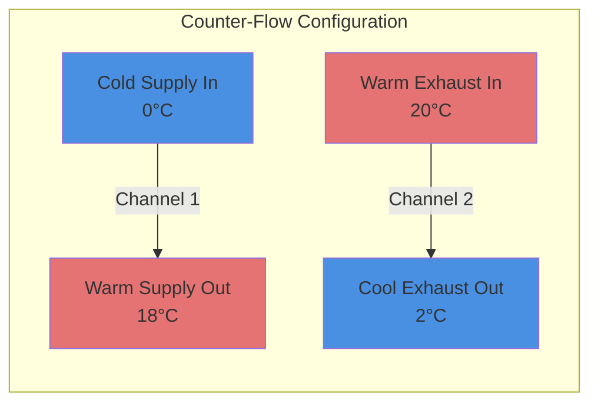
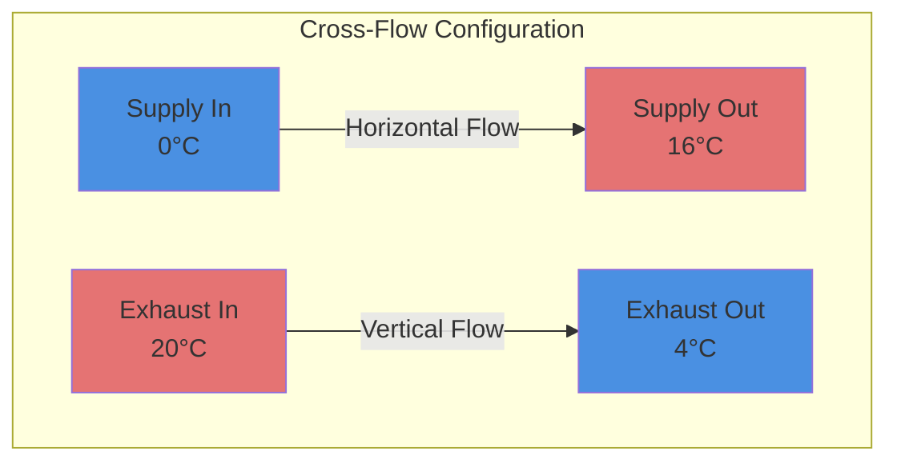
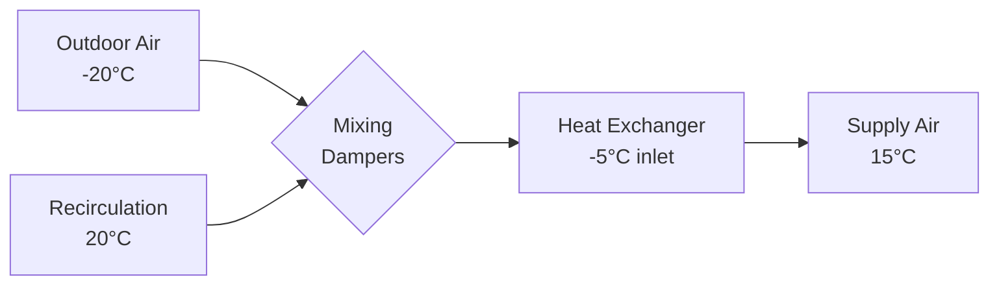

## Overview

Fixed plate heat exchangers represent the most common sensible energy recovery technology in commercial HVAC applications. These devices transfer thermal energy between supply and exhaust airstreams through thin metal or polymer plates arranged in alternating flow channels, achieving effectiveness values of 50-85% depending on configuration and operating conditions.

## Heat Transfer Configurations

### Counter-Flow Design

Counter-flow arrangements provide maximum heat transfer effectiveness by maintaining optimal temperature differentials along the entire heat transfer surface. Inlet air enters opposite ends of the exchanger, creating the highest theoretical efficiency.

**Effectiveness:** 70-85% under standard conditions

### Cross-Flow Design

Cross-flow exchangers orient supply and exhaust streams perpendicular to each other, simplifying installation and reducing pressure drop. This configuration dominates residential and light commercial applications due to manufacturing cost advantages.

**Effectiveness:** 50-70% under standard conditions

### Parallel-Flow Design

Parallel-flow configurations move both airstreams in the same direction. While less common due to lower effectiveness, this arrangement minimizes cross-contamination potential in critical applications.

**Effectiveness:** 40-60% under standard conditions

## NTU-Effectiveness Method

The Number of Transfer Units (NTU) method provides accurate performance prediction for all plate exchanger configurations:

$$\varepsilon = f(NTU, C_r, \text{flow arrangement})$$

Where:
- $\varepsilon$ = heat exchanger effectiveness (dimensionless)
- $NTU$ = number of transfer units (dimensionless)
- $C_r$ = heat capacity ratio $= C_{min}/C_{max}$

**Number of Transfer Units:**

$$NTU = \frac{UA}{C_{min}}$$

Where:
- $U$ = overall heat transfer coefficient (W/m²·K)
- $A$ = heat transfer surface area (m²)
- $C_{min}$ = minimum heat capacity rate (W/K)

**Counter-Flow Effectiveness:**

$$\varepsilon_{counter} = \frac{1 - e^{-NTU(1-C_r)}}{1 - C_r \cdot e^{-NTU(1-C_r)}}$$

For balanced flow ($C_r = 1$):

$$\varepsilon_{counter} = \frac{NTU}{1 + NTU}$$

**Cross-Flow Effectiveness (Both Streams Unmixed):**

$$\varepsilon_{cross} = 1 - \exp\left[\frac{NTU^{0.22}}{C_r}(\exp(-C_r \cdot NTU^{0.78}) - 1)\right]$$

## Pressure Drop Analysis

Pressure drop through plate exchangers directly impacts fan energy consumption and system economics. Accurate prediction requires accounting for friction losses and flow acceleration:

$$\Delta P = f \cdot \frac{L}{D_h} \cdot \frac{\rho v^2}{2} + K \cdot \frac{\rho v^2}{2}$$

Where:
- $f$ = Darcy friction factor (dimensionless)
- $L$ = flow path length (m)
- $D_h$ = hydraulic diameter (m)
- $\rho$ = air density (kg/m³)
- $v$ = average velocity (m/s)
- $K$ = minor loss coefficient for entrance/exit effects

**Hydraulic Diameter:**

$$D_h = \frac{4A_c}{P_w}$$

Where:
- $A_c$ = channel cross-sectional area (m²)
- $P_w$ = wetted perimeter (m)

Typical pressure drops range from 75-250 Pa at design airflow rates.

## Frost Control Strategies

Frost formation occurs when exhaust airstreams cool supply air below 0°C, causing moisture to freeze on heat transfer surfaces. This phenomenon reduces effectiveness and increases pressure drop, potentially blocking airflow entirely.

### Critical Frost Threshold

Frost risk increases significantly when:

$$T_{supply,out} < 0°C \quad \text{and} \quad \omega_{exhaust} > 0.003 \, \text{kg}_w/\text{kg}_{da}$$

Where $\omega$ represents humidity ratio.

### Defrost Methods

**1. Recirculation Damper Control**

Bypass a portion of warm building air around the heat exchanger during low outdoor temperatures:

**2. Preheat Coil**

Install heating coil upstream of heat exchanger to maintain inlet temperature above -10°C.

**3. Intermittent Operation**

Cycle exhaust airflow off periodically, allowing warm supply air to defrost surfaces (5-15 minute cycles).

**4. Rotation/Reversal**

Some designs support airflow reversal, using building exhaust heat to defrost supply-side surfaces.

## ASHRAE Standard 84 Testing

ASHRAE Standard 84-2020 establishes standardized test procedures for air-to-air heat exchangers, ensuring consistent performance ratings across manufacturers.

**Key Test Conditions:**

| Parameter | Winter Test | Summer Test |
|-----------|-------------|-------------|
| Outdoor Air Temperature | -18°C | 35°C |
| Indoor Air Temperature | 21°C | 24°C |
| Airflow Balance | 1:1 ratio | 1:1 ratio |
| Face Velocity | 1.5-2.5 m/s | 1.5-2.5 m/s |

**Reported Metrics:**

- Sensible effectiveness at multiple temperature conditions
- Pressure drop vs. airflow characteristics
- Frost formation thresholds
- Cross-leakage rates (target: <5%)
- Heat transfer coefficient degradation over time

## Material Considerations

**Aluminum:** High thermal conductivity (205 W/m·K), lightweight, cost-effective. Susceptible to corrosion in coastal environments.

**Polymer Films:** Corrosion-resistant, lower thermal conductivity (0.2-0.5 W/m·K), requires larger surface area. Excellent for high-humidity applications.

**Coated Steel:** Epoxy or polymer coatings protect carbon steel core, balancing thermal performance with corrosion resistance.

## Performance Optimization

**Increase Effectiveness:**
- Maximize heat transfer surface area
- Reduce plate spacing (1.5-3 mm optimal)
- Select counter-flow configuration
- Balance supply and exhaust airflows

**Reduce Pressure Drop:**
- Increase channel height
- Minimize flow path length
- Use streamlined entrance/exit geometries
- Maintain clean surfaces (filtration upstream)

## Maintenance Requirements

Fixed plate exchangers require minimal maintenance compared to rotating energy recovery wheels:

- **Quarterly:** Visual inspection for frost damage, verify defrost controls
- **Semi-Annual:** Measure pressure drop, clean accessible surfaces
- **Annual:** ASHRAE 84 effectiveness verification test
- **Every 3-5 Years:** Disassemble and deep clean internal surfaces

Properly maintained fixed plate heat exchangers provide 15-25 years of reliable service in commercial HVAC systems.

---

**Related Topics:** [Energy Recovery Ventilation](/ventilation-indoor-air-quality/ventilation-systems/energy-recovery-ventilation), [Heat Transfer Modeling](/sustainability-emerging-tech-economics/computational-methods-research/heat-transfer-modeling)
