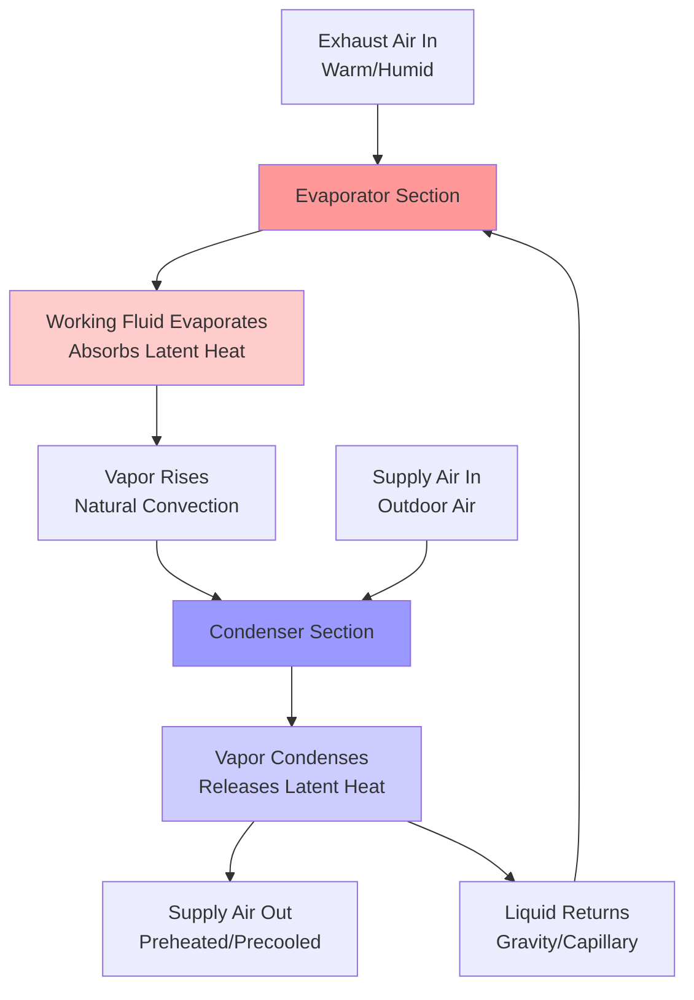
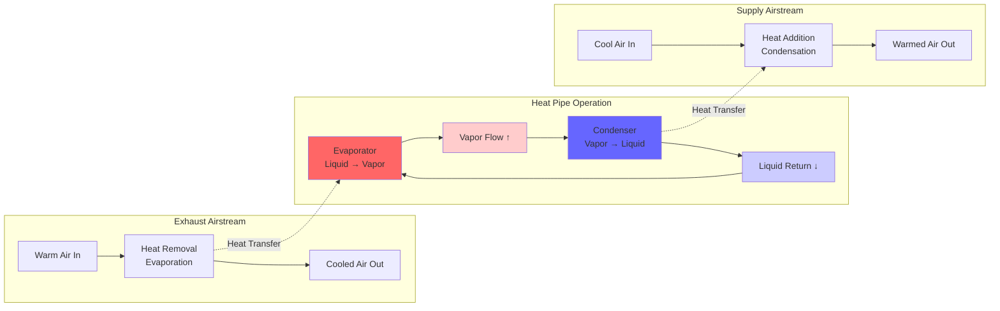

Heat pipes represent a passive energy recovery technology that transfers heat between supply and exhaust airstreams without moving parts, electrical input, or cross-contamination. These devices exploit phase-change heat transfer to achieve high thermal conductivity rates exceeding conventional metal conductors by orders of magnitude.

## Two-Phase Heat Transfer Principles

Heat pipes operate on a closed-loop evaporation-condensation cycle within sealed tubes containing a working fluid. The fundamental operating sequence involves evaporation at the hot end (exhaust air side), vapor migration to the cold end (supply air side), condensation releasing latent heat, and capillary return of liquid condensate to the evaporator section.

The working fluid selection depends on operating temperature range. Common refrigerants include R-134a for standard HVAC applications (-26°C to 93°C), water for elevated temperatures (30°C to 200°C), and ammonia for low-temperature applications (-60°C to 100°C). The fluid must exhibit appropriate vapor pressure characteristics at design conditions to maintain circulation without requiring external pumping.

### Thermal Resistance Model

Heat pipe thermal performance is characterized by serial thermal resistances from source to sink:

$$R_{total} = R_{evap} + R_{vapor} + R_{cond} + R_{wall}$$

Where:
- $R_{evap}$ = evaporator thermal resistance (K/W)
- $R_{vapor}$ = vapor flow thermal resistance (K/W)
- $R_{cond}$ = condenser thermal resistance (K/W)
- $R_{wall}$ = tube wall conduction resistance (K/W)

The heat transfer rate follows:

$$Q = \frac{T_{exhaust} - T_{supply}}{R_{total}}$$

For practical HVAC heat pipes, vapor flow resistance dominates at low heat fluxes, while evaporator and condenser film resistances control at higher loading.

## Heat Pipe Effectiveness

Thermal effectiveness quantifies the fraction of maximum possible heat transfer achieved by the heat pipe array:

$$\varepsilon = \frac{T_{supply,out} - T_{supply,in}}{T_{exhaust,in} - T_{supply,in}}$$

For balanced airflow rates (equal mass flow on both sides), effectiveness typically ranges from 45% to 65% depending on configuration. The Number of Transfer Units (NTU) method relates effectiveness to heat exchanger size:

$$\varepsilon = \frac{1 - e^{-NTU(1-C)}}{1 - C \cdot e^{-NTU(1-C)}}$$

Where:
- $NTU = \frac{UA}{\dot{m}_{min} c_p}$
- $C = \frac{\dot{m}_{min} c_p}{\dot{m}_{max} c_p}$ (capacity rate ratio)
- $U$ = overall heat transfer coefficient (W/m²·K)
- $A$ = total heat transfer area (m²)

For balanced flows where $C = 1$:

$$\varepsilon = \frac{NTU}{1 + NTU}$$

## Configuration and Design Parameters

Heat pipe energy recovery systems employ multiple parallel tubes arranged perpendicular to airflow, creating tube bundles similar to conventional coil geometry. Key design parameters include:

**Tube Geometry:**
- Diameter: 12-25 mm typical
- Length: 0.6-2.4 m depending on duct dimensions
- Rows deep: 4-12 rows for adequate NTU
- Fin spacing: 8-12 fins per inch for airside heat transfer enhancement

**Tilt Angle:**
Heat pipes require minimum inclination for gravity-assisted condensate return in wickless designs. ASHRAE Fundamentals recommends 5-10 degree minimum tilt from horizontal, with evaporator positioned below condenser. Wicked heat pipes can operate at any orientation but add cost and complexity.

**Heat Transfer Coefficient:**
The overall conductance accounts for both airside and refrigerant-side resistances:

$$\frac{1}{U} = \frac{1}{h_{air,supply}} + \frac{1}{h_{air,exhaust}} + \frac{1}{h_{refrigerant}} + \frac{t_{wall}}{k_{wall}}$$

Typical U-values range from 40-80 W/m²·K for finned tube heat pipe arrays with air velocities of 2-4 m/s.

## Applications and Performance

Heat pipe energy recovery ventilators find optimal application in systems requiring:

1. **Total air separation:** Zero cross-contamination between exhaust and supply streams suits healthcare, laboratories, and industrial exhaust applications where moisture or contaminant transfer is prohibited.

2. **Passive operation:** No electrical energy input for heat transfer mechanism reduces parasitic energy consumption and maintenance requirements.

3. **Sensible-only recovery:** Heat pipes transfer only sensible heat (temperature) without moisture exchange, beneficial in humid climates where latent heat recovery causes frosting issues.

**ASHRAE 90.1 Compliance:**
Energy Standard 90.1 Section 6.5.6.1 mandates energy recovery for systems exceeding specific outdoor air quantities. Heat pipe systems typically achieve 50-60% sensible effectiveness, meeting prescriptive requirements for climate zones requiring energy recovery ventilation.

**Capacity and Sizing:**
Heat pipe recovery capacity scales with tube quantity and airflow:

$$Q_{recovered} = \varepsilon \cdot \dot{m}_{air} \cdot c_p \cdot (T_{exhaust} - T_{supply})$$

For a 2000 CFM (944 L/s) system with 60% effectiveness and 30°C temperature differential:
$$Q = 0.60 \times 944 \times 10^{-3} \times 1006 \times 30 = 17.1 \text{ kW (58,400 BTU/hr)}$$

## Limitations and Considerations

**Airflow Balance:**
Effectiveness degrades significantly with unbalanced airflows. Capacity ratio $C$ below 0.75 reduces thermal performance by 15-25% compared to balanced operation.

**Pressure Drop:**
Multiple tube rows generate static pressure penalties of 75-200 Pa (0.3-0.8 in. w.g.) requiring fan energy consideration in total energy recovery analysis.

**Frosting:**
Below approximately 0°C exhaust temperature, condensate freezing can block airflow. Bypass dampers, preheat coils, or tilt-back mechanisms prevent frost accumulation during extreme conditions.

**Orientation Dependency:**
Gravity-return heat pipes require specific installation angles, limiting retrofit applications in space-constrained mechanical rooms.

Heat pipe technology provides robust, maintenance-free energy recovery with exceptional reliability for applications prioritizing air separation and passive operation over maximum effectiveness.
