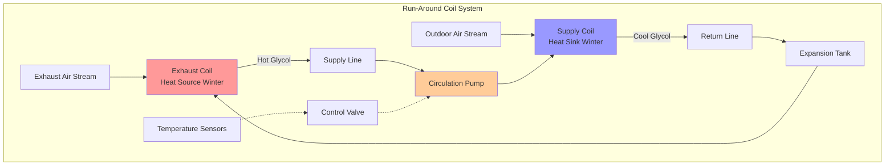

## Overview

Run-around coil systems provide sensible heat recovery between spatially separated exhaust and supply air streams. A pumped glycol solution circulates between coils in the exhaust and supply airstreams, transferring energy without direct air-to-air contact. This configuration offers installation flexibility where direct heat recovery devices cannot be used due to separation distance, contamination concerns, or building layout constraints.

## System Configuration

Run-around loops consist of finned-tube coils installed in both airstreams, interconnecting piping, a circulation pump, an expansion tank, and glycol solution. The exhaust air coil acts as the heat source (heating mode) or heat sink (cooling mode), while the supply air coil performs the complementary function.

### Physical Arrangement

The coils are positioned perpendicular to airflow in the exhaust and outdoor air ductwork. Typical separation distances range from 3 m to over 100 m, limited primarily by pumping energy requirements. Coil face velocity should be maintained between 2.0 and 3.5 m/s for optimal heat transfer and reasonable pressure drop.

## Heat Transfer Effectiveness

The effectiveness of a run-around coil system quantifies the ratio of actual energy transfer to the theoretical maximum. Per ASHRAE Standard 84, sensible effectiveness is defined as:

$$\varepsilon_s = \frac{Q_{actual}}{Q_{max}} = \frac{\dot{m}_{sa} c_p (T_{sa,out} - T_{sa,in})}{\dot{m}_{min} c_p (T_{ea,in} - T_{sa,in})}$$

Where:
- $\varepsilon_s$ = sensible effectiveness (dimensionless)
- $Q_{actual}$ = actual heat transfer rate (W)
- $Q_{max}$ = maximum possible heat transfer (W)
- $\dot{m}_{sa}$ = supply air mass flow rate (kg/s)
- $\dot{m}_{min}$ = minimum of supply or exhaust mass flow rates (kg/s)
- $c_p$ = specific heat of air (J/kg·K)
- $T_{ea,in}$ = entering exhaust air temperature (°C)
- $T_{sa,in}$ = entering supply air temperature (°C)
- $T_{sa,out}$ = leaving supply air temperature (°C)

Typical run-around coil effectiveness ranges from 45% to 65%, lower than rotary heat exchangers (70-85%) or fixed-plate exchangers (50-75%) but acceptable given the flexibility advantage.

### Coil Effectiveness Relationship

Individual coil effectiveness follows the NTU (Number of Transfer Units) method:

$$\varepsilon_{coil} = 1 - e^{-NTU}$$

For cross-flow configuration with both fluids unmixed:

$$NTU = \frac{UA}{\dot{m}_{min} c_p}$$

Where:
- $U$ = overall heat transfer coefficient (W/m²·K)
- $A$ = coil face area (m²)

The overall system effectiveness depends on both coil effectiveness values and the capacity rate ratio.

## Glycol Solution Properties

Ethylene glycol or propylene glycol solutions prevent freezing in winter operation. The required concentration depends on the minimum expected fluid temperature, which occurs when exhaust air approaches outdoor design temperature.

### Antifreeze Concentration

The required glycol concentration by volume for freeze protection:

$$C_{glycol} = \frac{T_{freeze} - T_{min,fluid}}{T_{freeze} - T_{pure,glycol}} \times 100\%$$

For propylene glycol with typical protection to -20°C:

$$C_{glycol} = \frac{0 - (-20)}{0 - (-59)} \times 100\% = 33.9\%$$

Standard practice specifies 40-50% propylene glycol for -18°C to -29°C protection, providing safety margin beyond theoretical requirements.

### Solution Properties Impact

Glycol concentration affects thermal performance:

| Glycol % | Specific Heat (kJ/kg·K) | Density (kg/m³) | Viscosity (cP at 20°C) |
|----------|-------------------------|-----------------|------------------------|
| 0% (water) | 4.18 | 998 | 1.0 |
| 30% | 3.91 | 1027 | 2.5 |
| 50% | 3.58 | 1041 | 5.0 |

Higher glycol concentrations reduce specific heat and increase viscosity, requiring larger pumps and reducing heat transfer coefficients by 10-20%.

## Coil Sizing Methodology

Coil selection balances heat transfer effectiveness against air-side pressure drop and cost.

### Required Face Area

$$A_{face} = \frac{\dot{V}}{v_{face}}$$

Where:
- $A_{face}$ = coil face area (m²)
- $\dot{V}$ = volumetric airflow rate (m³/s)
- $v_{face}$ = face velocity, typically 2.5 m/s (m/s)

### Number of Rows

The required number of rows depends on target effectiveness:

$$N_{rows} = \frac{-\ln(1 - \varepsilon_{coil})}{k}$$

Where $k$ = effectiveness factor per row (typically 0.20-0.25 for standard coils).

For 55% coil effectiveness: $N_{rows} = \frac{-\ln(0.45)}{0.22} = 3.6$ → use 4 rows.

Typical configurations use 4-8 rows for exhaust coils and 4-6 rows for supply coils.

## Pump Selection

Circulation pump sizing requires calculation of system head loss and required flow rate.

### Glycol Flow Rate

$$\dot{m}_{glycol} = \frac{Q}{c_{p,glycol} \Delta T_{glycol}}$$

Typical temperature differential across coils: 5-10°C.

For a 10 kW heat transfer with 8°C differential and 40% propylene glycol:

$$\dot{m}_{glycol} = \frac{10000}{3750 \times 8} = 0.333 \text{ kg/s} = 1200 \text{ kg/h}$$

### System Pressure Drop

Total head includes coil pressure drop, piping friction, and fittings:

$$\Delta P_{total} = \Delta P_{coils} + \Delta P_{pipe} + \Delta P_{fittings}$$

Coil pressure drop typically ranges from 20-40 kPa per coil. Piping losses calculated using Darcy-Weisbach equation with viscosity correction for glycol.

Pump power consumption:

$$P_{pump} = \frac{\dot{V}_{glycol} \Delta P_{total}}{\eta_{pump}}$$

Where $\eta_{pump}$ = pump efficiency (typically 0.50-0.70 for small circulating pumps).

## Controls and Modulation

Face and bypass dampers or three-way control valves modulate heat recovery to prevent supply air overcooling or overheating. The control valve throttles glycol flow based on supply air discharge temperature.

Freeze protection requires:
- Low-limit thermostat on supply coil discharge
- Glycol temperature monitoring
- Pump flow verification
- Emergency shutdown at -2°C supply air

## Code Requirements

ASHRAE Standard 90.1 requires energy recovery on systems exceeding specified airflow and operating hours thresholds. Run-around coils satisfy this requirement when:

- Design effectiveness ≥ 50% (Standard 90.1-2019, Section 6.5.6.1)
- Testing per ASHRAE Standard 84 methodology
- Bypass capability provided for economizer operation

## Application Considerations

**Advantages:**
- Separation of contaminated exhaust from supply air
- Flexible installation with large separation distances
- No cross-leakage between airstreams
- Retrofit-friendly configuration

**Limitations:**
- Lower effectiveness than direct recovery systems
- Parasitic pump energy consumption (50-150 W typical)
- Glycol maintenance requirements
- Higher initial cost than plate exchangers for close-coupled applications

## Maintenance Requirements

Annual maintenance includes:
- Glycol concentration testing (refractometer or hydrometer)
- pH testing (maintain 8.5-10.5)
- Visual inspection for leaks
- Pump performance verification
- Coil cleaning if air-side fouling observed

Glycol degradation occurs over 3-5 years, requiring partial or complete replacement when pH drops below 7.5 or inhibitor concentration is depleted.

## Performance Monitoring

Key performance indicators:
- Entering and leaving air temperatures (four points)
- Glycol supply and return temperatures
- Glycol flow rate
- Air-side pressure drop across coils
- Pump electrical consumption

Effectiveness degradation of more than 10% from design indicates coil fouling, reduced glycol flow, or system air leakage requiring investigation.

## Conclusion

Run-around coil systems provide practical energy recovery where physical separation, contamination concerns, or installation constraints preclude direct heat exchange devices. Proper sizing of coils, pumps, and glycol concentration ensures reliable operation and effectiveness of 50-65%. While parasitic energy consumption and lower effectiveness compared to rotary or plate exchangers represent trade-offs, the flexibility and contamination prevention justify run-around coils in many commercial and institutional applications.
