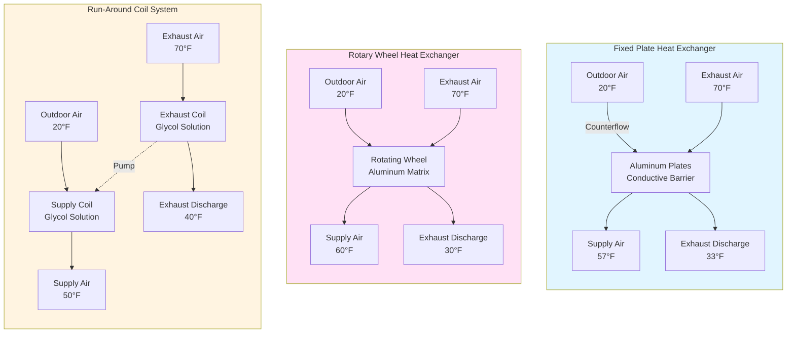

Sensible heat recovery systems transfer thermal energy between exhaust and supply airstreams without exchanging moisture. These devices recover heating and cooling energy from building exhaust air to precondition incoming outdoor ventilation air, reducing HVAC energy consumption by 45-85% depending on exchanger type and operating conditions.

## Sensible Effectiveness

Sensible effectiveness (εs) quantifies the fraction of available temperature difference recovered by the heat exchanger. This dimensionless parameter ranges from 0 (no recovery) to 1.0 (complete recovery).

$$\varepsilon_s = \frac{T_{sa,leaving} - T_{oa,entering}}{T_{ea,entering} - T_{oa,entering}}$$

Where:
- Tsa,leaving = supply air temperature leaving heat exchanger (°F)
- Toa,entering = outdoor air temperature entering heat exchanger (°F)
- Tea,entering = exhaust air temperature entering heat exchanger (°F)

For heating mode (winter operation), a heat exchanger with 75% sensible effectiveness recovering from 70°F exhaust air to precondition 20°F outdoor air delivers:

$$T_{sa,leaving} = T_{oa,entering} + \varepsilon_s(T_{ea,entering} - T_{oa,entering})$$

$$T_{sa,leaving} = 20 + 0.75(70 - 20) = 57.5°F$$

This 37.5°F temperature rise reduces heating load substantially compared to conditioning outdoor air from 20°F to supply temperature.

## Heat Transfer Fundamentals

Sensible heat transfer rate through the exchanger follows:

$$\dot{Q}_s = \dot{m} c_p \Delta T = \dot{m} c_p \varepsilon_s (T_{ea,entering} - T_{oa,entering})$$

Where:
- Q̇s = sensible heat transfer rate (BTU/hr)
- ṁ = air mass flow rate (lb/hr)
- cp = specific heat of air = 0.24 BTU/(lb·°F)
- ΔT = temperature change of outdoor air (°F)

For 5,000 cfm airflow at standard conditions (ρ = 0.075 lb/ft³):

$$\dot{m} = 5000 \times 60 \times 0.075 = 22,500 \text{ lb/hr}$$

With εs = 0.75 and 50°F temperature differential:

$$\dot{Q}_s = 22,500 \times 0.24 \times 0.75 \times 50 = 202,500 \text{ BTU/hr (16.9 tons)}$$

The UA (overall heat transfer coefficient times area) product determines exchanger thermal performance:

$$UA = \frac{\dot{Q}_s}{LMTD}$$

Where LMTD is the log mean temperature difference between airstreams.

## Sensible Heat Exchanger Technologies

Three primary technologies dominate sensible heat recovery applications, each with distinct operating characteristics and selection criteria.

### Fixed Plate Heat Exchangers

Aluminum or polymer plates form alternating passages for supply and exhaust airstreams in counterflow or crossflow configurations. Conductive heat transfer through plate walls exchanges sensible energy between airstreams with zero air mixing.

**Performance Characteristics:**
- Sensible effectiveness: 50-85% (counterflow superior to crossflow)
- Pressure drop: 0.3-0.8 inches water column
- Zero cross-contamination between airstreams
- No moving parts requiring maintenance

**Counterflow vs Crossflow Configurations:**

Counterflow arrangements achieve higher effectiveness because airstreams flow in opposite directions, maintaining maximum temperature differential throughout the exchanger length. For balanced flows (equal supply and exhaust airflow rates):

$$\varepsilon_{s,counterflow} = \frac{1 - \exp[-NTU(1-C^*)]}{1 - C^* \exp[-NTU(1-C^*)]}$$

For balanced flows where C* = 1:

$$\varepsilon_{s,counterflow} = \frac{NTU}{1 + NTU}$$

Crossflow configurations exhibit lower effectiveness due to non-optimal temperature profiles:

$$\varepsilon_{s,crossflow} = 1 - \exp\left[\frac{NTU^{0.22}}{C^*}\left(\exp(-C^* \cdot NTU^{0.78}) - 1\right)\right]$$

Where NTU (Number of Transfer Units) represents the heat exchanger thermal size parameter.

**Frost Formation Considerations:**

When exhaust air moisture condenses and freezes on cold outdoor air surfaces (outdoor air below 32°F), frost accumulation blocks airflow and degrades performance. Defrost strategies include:
- Preheat coil upstream of heat exchanger
- Bypass dampers to temporarily stop heat recovery
- Exhaust air recirculation to warm outdoor air stream

### Rotary Wheel Heat Exchangers

Rotating wheel with aluminum matrix transfers heat as it alternates between exhaust and supply airstreams. Wheel rotation speed typically ranges from 10-20 RPM.

**Performance Characteristics:**
- Sensible effectiveness: 65-85%
- Pressure drop: 0.5-1.0 inches water column
- Requires motor, bearings, drive system maintenance
- 1-3% cross-contamination from carryover air in wheel matrix

Heat transfer occurs through periodic heating and cooling of the rotating wheel material. The wheel absorbs heat from the warmer airstream and releases it to the cooler airstream during each rotation.

**Advantages:**
- High effectiveness across wide operating range
- Compact footprint relative to performance
- Self-cleaning action reduces fouling
- Minimal frost formation risk (continuous rotation prevents ice buildup)

**Limitations:**
- Moving parts require regular maintenance
- Cross-contamination prohibits use with hazardous exhaust
- Higher pressure drop than fixed plate
- Purge section needed to minimize carryover

### Run-Around Coil Systems

Glycol solution circulates between finned-tube coils in exhaust and supply airstreams, transferring sensible heat through the pumped fluid loop. Typical glycol concentration: 25-40% for freeze protection.

**Performance Characteristics:**
- Sensible effectiveness: 45-65%
- Pressure drop: 0.4-0.9 inches water column per coil
- Pump energy penalty: 0.5-2.0 kW depending on system size
- Zero cross-contamination

Heat transfer effectiveness depends on coil surface area, glycol flow rate, and temperature approach:

$$\varepsilon_s = \frac{1}{\frac{1}{\varepsilon_{coil,supply}} + \frac{1}{\varepsilon_{coil,exhaust}} - 1}$$

**Critical Advantage:**

Run-around coils enable energy recovery where exhaust and supply ductwork cannot be located adjacently. Glycol piping can extend hundreds of feet between coils, providing flexibility impossible with plate or wheel exchangers.

**Selection Criteria:**
- Exhaust and supply ducts separated by distance or barriers
- Cross-contamination absolutely prohibited (healthcare, laboratories)
- Existing buildings where adding ducted exchangers is impractical

## ASHRAE Standard 84 Testing Methods

ASHRAE Standard 84 "Method of Testing Air-to-Air Heat/Energy Exchangers" establishes standardized performance testing procedures for all heat recovery devices.

**Test Conditions:**

Standard rating conditions verify performance at:
- Winter: 0°F outdoor air, 70°F exhaust air
- Summer: 95°F outdoor air, 75°F exhaust air
- Balanced airflow rates (equal supply and exhaust cfm)

**Measured Parameters:**
1. Airflow rates (supply and exhaust sides)
2. Inlet and outlet dry-bulb temperatures (four measurements)
3. Inlet and outlet wet-bulb temperatures (four measurements)
4. Static pressure drop across each side
5. Power consumption of auxiliary equipment (fans, pumps, motors)

**Effectiveness Calculation per Standard 84:**

Sensible effectiveness uses dry-bulb temperatures only:

$$\varepsilon_s = \frac{T_{1,out} - T_{1,in}}{T_{2,in} - T_{1,in}}$$

Where subscript 1 denotes the airstream with minimum heat capacity rate (ṁcp)min.

**Frost Accumulation Testing:**

Standard 84 includes frost testing protocols for cold climate applications:
- Continuous operation at -13°F outdoor air, 70°F, 50% RH exhaust air
- Monitor pressure drop increase indicating frost buildup
- Verify defrost control operation and recovery time

## Energy Savings Calculations

**Example Application:** Office building in Climate Zone 5A requiring 8,000 cfm outdoor air.

**Winter Heating Season Analysis:**

Design conditions:
- Outdoor air: 0°F
- Exhaust air: 70°F
- Fixed plate HRV: εs = 0.75
- Operating hours: 2,500 hours/year heating season

Temperature rise through HRV:

$$\Delta T = 0.75 \times (70 - 0) = 52.5°F$$

Heating energy recovery rate:

$$\dot{Q}_{recovered} = 1.08 \times CFM \times \Delta T = 1.08 \times 8000 \times 52.5 = 453,600 \text{ BTU/hr}$$

Annual heating energy savings (assuming 80% furnace efficiency):

$$E_{saved} = \frac{453,600 \times 2500}{0.80 \times 100,000} = 14,175 \text{ therms/year}$$

At $1.20/therm: **Annual savings = $17,010**

**Summer Cooling Season Analysis:**

Design conditions:
- Outdoor air: 95°F
- Exhaust air: 75°F
- Operating hours: 1,500 hours/year cooling season

Temperature reduction through HRV:

$$\Delta T = 0.75 \times (95 - 75) = 15°F$$

Cooling energy recovery rate:

$$\dot{Q}_{recovered} = 1.08 \times 8000 \times 15 = 129,600 \text{ BTU/hr (10.8 tons)}$$

Annual cooling energy savings (assuming EER = 10):

$$E_{saved} = \frac{129,600 \times 1500}{10 \times 1000} = 19,440 \text{ kWh/year}$$

At $0.12/kWh: **Annual savings = $2,333**

**Total annual energy cost savings: $19,343**

For a typical installed cost of $40,000-$60,000 for this system size, simple payback ranges from 2.1-3.1 years, demonstrating strong economic performance.

## Conclusion

Sensible heat recovery systems provide substantial energy savings for ventilation-intensive applications. Fixed plate exchangers deliver maintenance-free operation with zero cross-contamination, rotary wheels achieve highest effectiveness in compact configurations, and run-around coils enable recovery where ductwork proximity prevents other technologies. ASHRAE Standard 84 testing ensures performance verification, while energy savings calculations demonstrate rapid payback in most commercial applications. Select technology based on cross-contamination tolerance, maintenance capabilities, spatial constraints, and climate-specific operating conditions.
