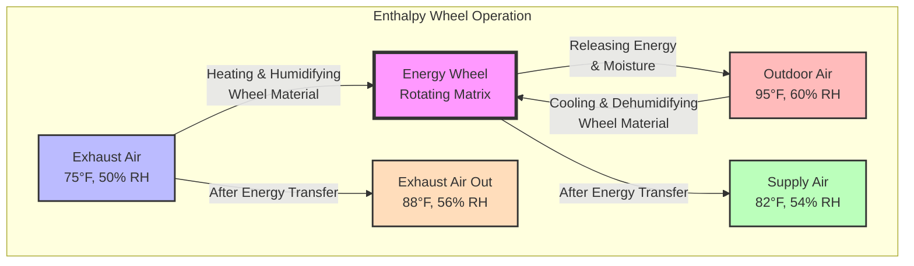
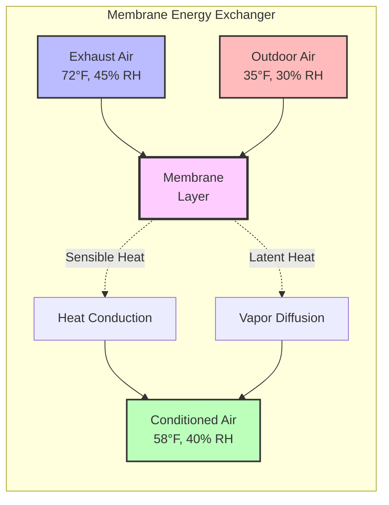

# Total Energy Recovery: Sensible and Latent Transfer

Total energy recovery (TER) systems recover both sensible heat and latent heat (moisture) from exhaust air streams, maximizing energy efficiency in ventilation applications. Unlike sensible-only heat recovery, TER systems transfer enthalpy, reducing both heating/cooling loads and humidification/dehumidification requirements.

## Fundamental Principles

### Enthalpy Transfer Mechanism

Total energy recovery operates on the principle of simultaneous heat and mass transfer. When two air streams at different temperatures and humidity ratios flow through a TER device, energy transfer occurs in two forms:

**Sensible heat transfer** follows temperature difference:
$$Q_s = \dot{m} \cdot c_p \cdot (T_1 - T_2)$$

**Latent heat transfer** follows moisture content difference:
$$Q_l = \dot{m} \cdot h_{fg} \cdot (W_1 - W_2)$$

where $\dot{m}$ is mass flow rate, $c_p$ is specific heat of air, $h_{fg}$ is latent heat of vaporization (approximately 1,060 BTU/lb or 2,465 kJ/kg), and $W$ is humidity ratio.

**Total enthalpy transfer** combines both:
$$Q_t = \dot{m} \cdot (h_1 - h_2)$$

where $h$ represents specific enthalpy of the moist air stream.

### Total Effectiveness

Per ASHRAE Standard 84-2020, total effectiveness quantifies the device's ability to transfer enthalpy between air streams:

$$\varepsilon_t = \frac{h_{supply,out} - h_{outdoor}}{h_{exhaust,in} - h_{outdoor}}$$

This can be decomposed into sensible and latent components:

$$\varepsilon_t = \frac{\varepsilon_s \cdot c_p \cdot (T_{exh} - T_{oa}) + \varepsilon_l \cdot h_{fg} \cdot (W_{exh} - W_{oa})}{h_{exh} - h_{oa}}$$

Typical total effectiveness values range from 60% to 85% for commercially available systems.

## Total Energy Recovery Technologies

### Energy Wheels (Enthalpy Wheels)

Energy wheels consist of rotating matrices of hygroscopic materials that absorb and desorb both heat and moisture.

**Construction characteristics:**
- Desiccant-coated aluminum or synthetic substrate
- Rotation speeds: 10-20 rpm typical
- Matrix depth: 200-500 mm
- Wheel diameter: 0.6-4.0 meters

**Performance parameters:**
- Total effectiveness: 70-85%
- Sensible effectiveness: 75-90%
- Latent effectiveness: 50-75%
- Pressure drop: 0.4-1.2 in. w.g. (100-300 Pa)

**Cross-contamination control:**
Energy wheels inherently allow minimal air transfer between streams (typically 1-5%). Purge sectors can reduce carryover to less than 1%.

### Membrane Energy Exchangers

Fixed-plate or counter-flow membrane exchangers use semi-permeable materials that allow water vapor transmission while preventing air mixing.

**Membrane types:**

1. **Polymer membranes** - Polyethylene, polypropylene with molecular sieves
2. **Treated paper** - Cellulose-based hygroscopic materials
3. **Synthetic composites** - Multi-layer engineered materials

**Operating principles:**

**Performance characteristics:**
- Total effectiveness: 60-75%
- Zero cross-contamination (complete separation)
- No moving parts (higher reliability)
- Pressure drop: 0.3-0.8 in. w.g. (75-200 Pa)
- Requires periodic cleaning

### Desiccant-Enhanced Systems

Advanced systems incorporate liquid or solid desiccants to enhance moisture transfer capacity, particularly valuable in high-humidity climates.

**Configuration types:**

1. **Rotating desiccant wheels** with enhanced hygroscopic coatings (silica gel, molecular sieves, lithium chloride)
2. **Liquid desiccant loops** using lithium chloride or calcium chloride solutions
3. **Hybrid membrane-desiccant** combining technologies

**Enhanced moisture removal:**
Desiccant systems achieve latent effectiveness exceeding 80%, compared to 50-70% for standard energy wheels.

## Climate-Specific Performance

### Cooling-Dominated Climates

In hot-humid conditions (Miami, Houston), total energy recovery significantly reduces dehumidification loads:

$$Q_{total,saved} = \dot{V} \cdot \rho \cdot (h_{oa} - h_{supply}) \cdot \varepsilon_t$$

Summer design example (1,000 CFM):
- Outdoor: 95°F, 70% RH (h = 46.5 BTU/lb)
- Exhaust: 75°F, 50% RH (h = 28.2 BTU/lb)
- With 75% total effectiveness: Supply at 81°F, 58% RH (h = 32.8 BTU/lb)
- Energy recovered: 102,000 BTU/hr (30 kW)

### Heating-Dominated Climates

In cold-dry conditions (Minneapolis, Calgary), TER prevents excessive indoor humidity loss:

Winter design example (1,000 CFM):
- Outdoor: 0°F, 60% RH (h = 0.9 BTU/lb)
- Exhaust: 70°F, 30% RH (h = 19.7 BTU/lb)
- With 75% total effectiveness: Supply at 56°F, 32% RH (h = 15.6 BTU/lb)
- Energy recovered: 110,000 BTU/hr (32 kW)

### Mixed Climates

Year-round operation in moderate climates (San Francisco, Seattle) requires bypass dampers or modulating controls to prevent over-recovery during mild conditions.

## ASHRAE Standards and Code Requirements

### ASHRAE Standard 84-2020

Establishes testing and rating procedures for air-to-air heat exchangers:

**Test conditions:**
- Balanced flow (supply = exhaust CFM)
- Standard airflow rates: 500, 1000, 2000 CFM per test
- Multiple temperature/humidity combinations
- Frost accumulation testing for total energy recovery

**Reported performance data:**
- Sensible effectiveness ($\varepsilon_s$)
- Latent effectiveness ($\varepsilon_l$)
- Total effectiveness ($\varepsilon_t$)
- Pressure drop for supply and exhaust streams
- Cross-contamination percentage

### ASHRAE Standard 90.1-2022 Requirements

**Section 6.5.6.1** mandates energy recovery for systems meeting specific criteria:

| Climate Zone | Design Outdoor Air | System Operating Hours |
|--------------|-------------------|------------------------|
| 1-2 (Hot) | ≥ 5,000 CFM | ≥ 8,000 hr/yr |
| 3-4 (Moderate) | ≥ 5,000 CFM | ≥ 8,000 hr/yr |
| 5-8 (Cold) | ≥ 3,000 CFM | ≥ 8,000 hr/yr |

**Minimum effectiveness requirements:**
- Total effectiveness ≥ 50% in all climate zones
- Higher requirements for larger systems (60% for systems ≥ 20,000 CFM)

**Exceptions:**
- Laboratory hoods with hazardous exhaust
- Systems serving spaces with high particulate loads
- Applications where outdoor air fraction exceeds 70%

## System Selection Considerations

### Application-Specific Factors

**Energy wheels preferred for:**
- High effectiveness requirements (75-85%)
- Balanced sensible/latent loads
- Commercial office buildings, schools

**Membrane exchangers preferred for:**
- Sensitive applications requiring zero cross-contamination
- Hospitals, laboratories, food processing
- Corrosive exhaust streams

**Desiccant systems preferred for:**
- High-humidity climates (coastal, tropical)
- Applications requiring deep dehumidification
- Indoor pools, spas, museums

### Economic Analysis

Payback period depends on:
- Operating hours per year
- Outdoor air fraction
- Local utility rates
- Climate severity

$$\text{Simple Payback (years)} = \frac{\text{Installed Cost}}{\text{Annual Energy Savings} - \text{Annual Maintenance}}$$

Typical installed costs range from $1.50 to $3.50 per CFM for commercial applications.

## Maintenance and Longevity

### Energy Wheel Maintenance

- **Inspect rotation mechanism:** Quarterly
- **Clean wheel matrix:** Annually or bi-annually
- **Check belt tension and drive motor:** Quarterly
- **Replace desiccant coating:** 10-15 years typical life

### Membrane Exchanger Maintenance

- **Inspect for blockage:** Quarterly
- **Clean membrane surfaces:** Annually (pressure washing or chemical cleaning)
- **Check gaskets and seals:** Annually
- **Replace membrane cores:** 15-20 years typical life

Proper maintenance ensures sustained effectiveness throughout the equipment lifecycle, maximizing return on investment for total energy recovery systems.
