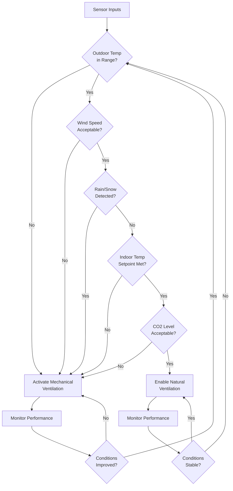

## Overview

Hybrid or mixed-mode ventilation systems combine natural and mechanical ventilation strategies to optimize energy efficiency while maintaining indoor air quality and thermal comfort. These systems leverage natural driving forces—wind pressure and buoyancy—when conditions permit, and activate mechanical systems when natural ventilation proves insufficient.

ASHRAE Standard 62.1 recognizes hybrid ventilation as a viable strategy for meeting outdoor air requirements, provided proper controls ensure adequate ventilation rates under all operating conditions.

## Fundamental Operating Modes

Hybrid ventilation operates in three distinct configurations:

### Changeover Mode

The system switches between fully natural and fully mechanical ventilation based on outdoor conditions. Only one mode operates at any given time throughout the entire building.

**Control decision logic:**

$$
\text{Mode} =
\begin{cases}
\text{Natural} & \text{if } T_{\text{out}} \in [T_{\text{min}}, T_{\text{max}}] \land W < W_{\text{max}} \land \text{Rain} = \text{false} \\
\text{Mechanical} & \text{otherwise}
\end{cases}
$$

where $T_{\text{out}}$ is outdoor temperature, $W$ is wind speed, and the temperature band $[T_{\text{min}}, T_{\text{max}}]$ defines the natural ventilation comfort zone.

### Concurrent Mode

Natural and mechanical ventilation operate simultaneously. Mechanical systems provide base ventilation while operable windows or vents supplement airflow and provide occupant control.

The total ventilation rate:

$$
\dot{V}_{\text{total}} = \dot{V}_{\text{mech}} + \dot{V}_{\text{nat}}
$$

where $\dot{V}_{\text{mech}}$ is the mechanical airflow and $\dot{V}_{\text{nat}}$ is the natural ventilation contribution.

### Zoned Mode

Different building zones employ different ventilation strategies based on local conditions, occupancy, or thermal loads. Interior zones typically use mechanical ventilation while perimeter zones utilize natural ventilation when conditions allow.

## Natural Ventilation Driving Forces

The effectiveness of hybrid systems depends on understanding natural ventilation physics.

### Stack Effect

Buoyancy-driven flow results from temperature differences:

$$
\Delta P_{\text{stack}} = \rho_{\text{out}} g h \left( 1 - \frac{T_{\text{out}}}{T_{\text{in}}} \right)
$$

where:
- $\rho_{\text{out}}$ = outdoor air density (kg/m³)
- $g$ = gravitational acceleration (9.81 m/s²)
- $h$ = height difference between openings (m)
- $T_{\text{out}}$, $T_{\text{in}}$ = absolute temperatures (K)

### Wind-Driven Pressure

Surface pressure coefficients determine wind-induced pressure differences:

$$
\Delta P_{\text{wind}} = C_p \cdot \frac{1}{2} \rho v_{\text{ref}}^2
$$

where $C_p$ is the pressure coefficient (dimensionless), $\rho$ is air density, and $v_{\text{ref}}$ is reference wind speed at building height.

Combined driving forces yield the total pressure difference:

$$
\Delta P_{\text{total}} = \Delta P_{\text{stack}} + \Delta P_{\text{wind}}
$$

## Control Strategies

### Switching Criteria

Effective control requires multiple sensor inputs:

| Parameter | Natural Mode Range | Mechanical Mode Trigger |
|-----------|-------------------|------------------------|
| Outdoor Temperature | 15–25°C (59–77°F) | Outside range |
| Wind Speed | < 6 m/s (13 mph) | Excessive wind |
| Precipitation | Dry conditions | Rain/snow detected |
| Indoor CO₂ | < 1000 ppm | Elevated levels |
| Indoor Temperature | Within ±1°C setpoint | Deviation > 1°C |
| Outdoor Air Quality | AQI < 100 | Poor air quality |

### Deadband Control

Prevent frequent mode switching with temperature deadbands:

$$
\text{Switch to Mechanical if: } T_{\text{in}} > T_{\text{set}} + \Delta T_{\text{db}}
$$

$$
\text{Switch to Natural if: } T_{\text{in}} < T_{\text{set}} - \Delta T_{\text{db}}
$$

Typical deadband $\Delta T_{\text{db}} = 1.0–2.0°C$ prevents hunting between modes.

## Design Considerations

### Opening Sizing

Natural ventilation openings must provide adequate free area:

$$
A_{\text{eff}} = \frac{\dot{V}_{\text{req}}}{C_d \sqrt{2 \Delta P / \rho}}
$$

where:
- $A_{\text{eff}}$ = effective opening area (m²)
- $\dot{V}_{\text{req}}$ = required ventilation rate (m³/s)
- $C_d$ = discharge coefficient (0.60–0.65 typical)
- $\Delta P$ = pressure difference across opening (Pa)

### Thermal Mass Integration

High thermal mass delays indoor temperature response, extending natural ventilation hours. Night cooling using natural ventilation charges thermal mass for daytime cooling:

$$
Q_{\text{stored}} = \rho c_p V (T_{\text{day}} - T_{\text{night}})
$$

where $V$ is the effective volume of thermal mass.

## Performance Comparison

| Aspect | Pure Mechanical | Hybrid System | Pure Natural |
|--------|----------------|---------------|--------------|
| Energy Use | Highest | 30–60% reduction | Minimal |
| Control Precision | Excellent | Good | Limited |
| Occupant Interaction | None | Moderate | High |
| Initial Cost | Moderate | Highest | Lowest |
| Comfort Consistency | Excellent | Good | Variable |
| Applicable Climates | All | Temperate | Limited |

## Application Suitability

Hybrid ventilation performs optimally in:

- **Climate zones** with substantial swing seasons (ASHRAE climate zones 3–5)
- **Building types** with variable occupancy (offices, schools, laboratories)
- **Perimeter zones** with access to facades and operable elements
- **Low-rise construction** where stack effect can be effectively utilized
- **Sites** with favorable wind patterns and minimal noise/pollution

## Code Compliance

ASHRAE 62.1 requires that when natural ventilation provides required outdoor air:

- Opening area ≥ 4% of net occupiable floor area
- Openings on at least two walls or vertical height difference
- Continuous monitoring or controls demonstrate compliance
- Procedures document actual ventilation rates under design conditions

For hybrid systems, mechanical backup must activate when natural ventilation cannot meet minimum requirements:

$$
\dot{V}_{\text{mech}} \geq \dot{V}_{\text{min,ASHRAE}} - \dot{V}_{\text{nat,verified}}
$$

## Energy Savings Potential

Properly designed hybrid systems achieve significant energy reductions:

$$
\text{Energy Savings} = \frac{E_{\text{mech}} - E_{\text{hybrid}}}{E_{\text{mech}}} \times 100\%
$$

Field studies demonstrate 30–60% fan energy savings in temperate climates, with total HVAC energy reductions of 15–40% depending on climate and building type.

## Commissioning Requirements

Verification testing must confirm:

- Natural ventilation airflow rates under representative conditions
- Control sequences properly execute mode transitions
- Interlocks prevent simultaneous heating/cooling during natural ventilation
- Sensor calibration and placement accuracy
- Occupant interface functionality and override capabilities
- Weather station integration and data reliability

Functional performance testing per ASHRAE Guideline 0 validates that the system operates as designed across all anticipated operating scenarios.

---

**References:**
- ASHRAE Standard 62.1: Ventilation for Acceptable Indoor Air Quality
- ASHRAE Guideline 0: The Commissioning Process
- CIBSE AM13: Mixed Mode Ventilation
- ASHRAE Fundamentals Handbook, Chapter 16: Ventilation and Infiltration
