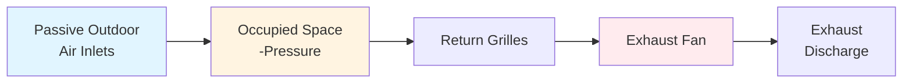
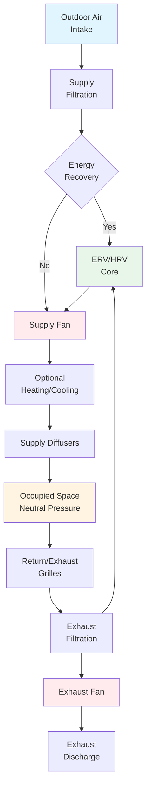

## Mechanical Ventilation Fundamentals

Mechanical ventilation employs fans to force air movement through buildings, providing controlled outdoor air delivery independent of weather conditions and building envelope characteristics. These systems ensure reliable indoor air quality while enabling precise pressure control and integration with heating and cooling equipment.

The three fundamental mechanical ventilation strategies differ in airflow direction and pressure management:

- **Supply-Only Systems**: Force outdoor air into spaces, creating positive pressure
- **Exhaust-Only Systems**: Remove indoor air, inducing negative pressure and infiltration
- **Balanced Systems**: Simultaneously supply and exhaust equal volumes, maintaining neutral pressure

## ASHRAE Standard 62.1 Ventilation Requirements

ASHRAE 62.1 establishes minimum ventilation rates through the Ventilation Rate Procedure (VRP). The zone outdoor air requirement combines people-based and area-based components:

$$V_{oz} = R_p \cdot P_z + R_a \cdot A_z$$

**Parameters:**
- $V_{oz}$ = zone outdoor air requirement (cfm)
- $R_p$ = people outdoor air rate (cfm/person), typically 5-10 cfm/person
- $P_z$ = zone population (design or default occupant density)
- $R_a$ = area outdoor air rate (cfm/ft²), typically 0.06-0.12 cfm/ft²
- $A_z$ = zone floor area (ft²)

For multi-zone systems, the total outdoor air intake must account for ventilation efficiency:

$$V_{ot} = \frac{\sum_{all\ zones} V_{oz} / E_z}{E_v}$$

Where:
- $E_z$ = zone air distribution effectiveness (0.8 for ceiling supply, 1.2 for displacement)
- $E_v$ = system ventilation efficiency (0.6-1.0 based on system type and zone diversity)

## Air Change Rate Calculations

Air change rate expresses ventilation as space volume exchanges per hour:

$$ACH = \frac{Q \cdot 60}{V}$$

**Where:**
- $ACH$ = air changes per hour (h⁻¹)
- $Q$ = volumetric flow rate (ft³/min)
- $V$ = space volume (ft³)

Converting from required ACH to flow rate:

$$Q = \frac{ACH \cdot V}{60}$$

For residential applications using ASHRAE 62.2, the minimum continuous ventilation rate:

$$Q_{fan} = 0.03 \cdot A_{floor} + 7.5 \cdot (N_{br} + 1)$$

Where $A_{floor}$ is conditioned floor area (ft²) and $N_{br}$ is number of bedrooms.

## Supply Ventilation Systems

Supply-only mechanical ventilation introduces outdoor air through fans, creating positive building pressure that reduces infiltration. The outdoor air passes through filtration and optional conditioning before distribution.

**Key Design Considerations:**

1. **Intake Location**: Minimum 25 ft from contamination sources, 10 ft above grade
2. **Filtration**: MERV 8 minimum, MERV 13+ for enhanced particulate control
3. **Distribution**: High sidewall or ceiling diffusers for effective mixing
4. **Relief Path**: Adequate free area for air to exit without excessive pressure buildup

**Advantages:**
- Prevents infiltration of unconditioned air
- Centralizes filtration at single intake point
- Enables outdoor air pre-conditioning
- Suitable for tight building envelopes

**Limitations:**
- Potential moisture accumulation in building cavities during cooling season
- Higher energy consumption if outdoor air requires full conditioning
- Difficulty maintaining uniform pressure in large or compartmentalized buildings

## Exhaust Ventilation Systems

Exhaust-only systems mechanically remove indoor air, creating negative pressure that draws outdoor air through envelope openings and intentional passive inlets.

**Applications:**
- Residential bathroom and kitchen exhaust
- Facilities requiring contamination containment (restrooms, laboratories)
- Industrial spaces with heat or pollutant generation
- Parking garages with CO control

**Design Requirements:**

Exhaust flow rate for general dilution:

$$Q_{exhaust} = \frac{G \cdot 10^6}{C_{max} - C_{ambient}}$$

Where:
- $G$ = contaminant generation rate (kg/s or lb/hr)
- $C_{max}$ = maximum acceptable concentration (ppm)
- $C_{ambient}$ = outdoor concentration (ppm)

**Advantages:**
- Prevents contaminant migration to adjacent spaces
- Simple installation with minimal ductwork
- No risk of summer condensation in building cavities
- Lower first cost than supply or balanced systems

**Limitations:**
- No control over outdoor air quality (enters unfiltered)
- Cannot pre-condition outdoor air
- Increased infiltration loads in winter
- Potential backdrafting of combustion appliances

## Balanced Ventilation Systems

Balanced systems provide equal supply and exhaust flows, maintaining neutral building pressure while enabling complete control over both incoming and outgoing airstreams.

**System Configurations:**

| Configuration | Supply Fan | Exhaust Fan | Energy Recovery | Application |
|--------------|------------|-------------|-----------------|-------------|
| Simple Balanced | Yes | Yes | None | Mild climates, low energy cost |
| HRV System | Yes | Yes | Sensible only | Cold climates, low latent loads |
| ERV System | Yes | Yes | Sensible + latent | Hot-humid and cold climates |
| DOAS | Yes | Yes | Typically included | All climates, high performance |

**Pressure Control Accuracy:**

Pressure differential between supply and exhaust:

$$\Delta P = P_{static,supply} - P_{static,exhaust}$$

Target: $|\Delta P| < 0.02$ in. w.c. for neutral pressure

**Advantages:**
- Complete outdoor air quality control (filtration, conditioning)
- No impact on building envelope pressure
- Highest energy recovery potential (50-80% effectiveness)
- Independent control of supply and exhaust locations
- Suitable for all climates and building types

**Limitations:**
- Highest installation cost and complexity
- Requires balancing of supply and exhaust flows
- Two fan systems increase maintenance requirements
- Energy recovery adds pressure drop and heat exchanger maintenance

## Fan Power and Energy Calculations

Mechanical ventilation fan power depends on flow rate and total pressure rise:

$$P_{fan} = \frac{Q \cdot \Delta P_{total}}{6356 \cdot \eta_{fan} \cdot \eta_{motor}}$$

**Where:**
- $P_{fan}$ = shaft power (hp)
- $Q$ = airflow rate (cfm)
- $\Delta P_{total}$ = total pressure rise (in. w.c.)
- $\eta_{fan}$ = fan total efficiency (0.50-0.80)
- $\eta_{motor}$ = motor efficiency (0.85-0.95)

Total pressure rise includes all system resistances:

$$\Delta P_{total} = \Delta P_{filters} + \Delta P_{coils} + \Delta P_{ERV} + \Delta P_{ductwork}$$

**Typical Pressure Drops:**
- Filters: 0.1-0.5 in. w.c. (clean to dirty)
- Heating/cooling coils: 0.2-0.5 in. w.c.
- ERV/HRV core: 0.3-0.8 in. w.c.
- Ductwork: 0.08-0.15 in. w.c. per 100 ft equivalent length

Annual fan energy consumption:

$$E_{annual} = P_{fan} \cdot 0.746 \cdot t_{operating} \cdot k$$

Where:
- $E_{annual}$ = annual energy (kWh)
- $t_{operating}$ = annual operating hours
- $k$ = part-load factor (0.7-0.9 for continuous operation)

## System Type Comparison

| Parameter | Supply Only | Exhaust Only | Balanced | Balanced + ERV |
|-----------|-------------|--------------|----------|----------------|
| First Cost | $ | $ | $$ | $$$ |
| Operating Cost | Medium | Low-Medium | Medium-High | Low-Medium |
| Filtration Control | Excellent | None | Excellent | Excellent |
| Pressure Control | Positive | Negative | Neutral | Neutral |
| Energy Recovery | None | None | Optional | Integrated |
| Humidity Control | Limited | None | Good | Excellent |
| Climate Suitability | Cold/Dry | Hot/Humid | All | All |
| Installation Complexity | Medium | Low | High | High |

## Energy Efficiency Considerations

Ventilation energy consumption consists of fan power and conditioning loads:

**Sensible Heating/Cooling Load:**

$$Q_{sensible} = 1.08 \cdot Q \cdot \Delta T$$

Where:
- $Q$ = airflow rate (cfm)
- $\Delta T$ = temperature difference between outdoor and supply air (°F)

**Latent Cooling Load:**

$$Q_{latent} = 4840 \cdot Q \cdot \Delta W$$

Where $\Delta W$ = humidity ratio difference (lb_w/lb_da)

**Energy Recovery Effectiveness:**

Sensible effectiveness:

$$\varepsilon_{sensible} = \frac{T_{supply} - T_{outdoor}}{T_{exhaust} - T_{outdoor}}$$

Total effectiveness (including latent):

$$\varepsilon_{total} = \frac{h_{supply} - h_{outdoor}}{h_{exhaust} - h_{outdoor}}$$

Where $h$ represents enthalpy (Btu/lb_da).

**Optimization Strategies:**

1. **Variable Speed Control**: Reduce fan speed during part-load conditions ($P_{fan} \propto Q^3$)
2. **Demand Control Ventilation**: Modulate outdoor air based on occupancy or CO₂ levels
3. **Energy Recovery**: Install ERV/HRV in climates with >2000 heating degree days or >1500 cooling degree days
4. **Economizer Integration**: Bypass energy recovery when outdoor conditions favor free cooling
5. **High-Efficiency Components**: Select fans with total efficiency >65%, motors with premium efficiency ratings
6. **Reduced Pressure Drop**: Minimize system resistance through proper sizing (duct velocity <1200 fpm in mains)

## Design Best Practices

1. **System Selection**: Choose balanced systems with energy recovery for buildings requiring >1000 cfm outdoor air in severe climates

2. **Fan Sizing**: Include 10-15% margin above calculated pressure drop for filter loading and system effects

3. **Airflow Measurement**: Install airflow measuring stations at outdoor air intakes (velocity averaging arrays or flow grids)

4. **Controls Integration**: Program BAS to maintain minimum ventilation at all operating conditions, including warm-up and setback

5. **Commissioning**: Verify outdoor air rates at design and part-load conditions, measure pressure relationships between zones

6. **Maintenance Access**: Provide adequate clearance for filter replacement (24 in. minimum) and coil inspection

7. **Intake Protection**: Install weather louvers with 300-500 fpm free area velocity, bird screens, and drain pans

8. **Exhaust Discharge**: Locate exhausts minimum 10 ft above adjacent roof surfaces, direct away from intakes and property lines

These mechanical ventilation principles enable the design of systems that reliably deliver required outdoor air while minimizing energy consumption and maintaining appropriate pressure relationships throughout the building.
