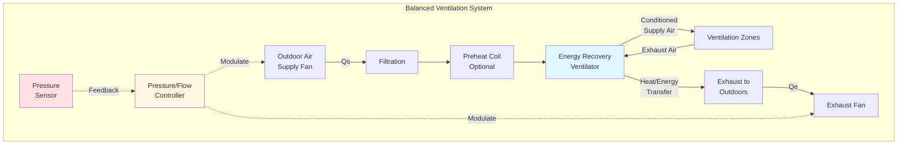

# Balanced Mechanical Ventilation Systems

Balanced mechanical ventilation systems maintain neutral or controlled building pressure by providing equal or proportional supply and exhaust airflow rates. This approach offers precise control over building pressurization, contaminant management, and energy recovery opportunities while ensuring proper outdoor air delivery per ASHRAE Standard 62.1.

## Fundamental Principles

A balanced ventilation system operates on the principle that **net airflow equals zero** (or a controlled offset) to maintain desired building pressure relationships. The system simultaneously introduces outdoor air via supply fans and removes indoor air via exhaust fans.

### Pressure Balance Equation

The building pressure differential relative to outdoors is governed by:

$$\Delta P_b = \frac{\rho}{2} \left[ \left(\frac{Q_s - Q_e}{A_L C_d}\right)^2 \right]$$

Where:
- $\Delta P_b$ = building pressure differential (Pa)
- $\rho$ = air density (kg/m³)
- $Q_s$ = supply airflow rate (m³/s)
- $Q_e$ = exhaust airflow rate (m³/s)
- $A_L$ = effective leakage area (m²)
- $C_d$ = discharge coefficient (typically 0.6-0.65)

For **neutral pressure** ($\Delta P_b = 0$):

$$Q_s = Q_e$$

### Airflow Balance Tolerance

ASHRAE 62.1 requires outdoor air intake rates to meet ventilation zone requirements. Practical balanced systems maintain:

$$0.95 \leq \frac{Q_s}{Q_e} \leq 1.05$$

This ±5% tolerance accommodates measurement uncertainty and control limitations while preventing significant pressure imbalances.

## System Configuration

## Building Pressurization Control

### Intentional Pressure Offset

Certain applications require controlled positive or negative pressure:

**Positive Pressure** (cleanrooms, hospitals, isolation rooms):

$$Q_s = Q_e + Q_{offset}$$

Where $Q_{offset}$ creates the desired positive pressure differential (typically 2.5-15 Pa).

**Negative Pressure** (laboratories, industrial facilities, containment areas):

$$Q_e = Q_s + Q_{offset}$$

The offset airflow exfiltrates or infiltrates through the building envelope.

### Pressure Control Strategies

**Direct Pressure Control**: Modulates supply and/or exhaust fans based on building pressure sensor feedback using PID control:

$$Q_{s,adj} = Q_{s,sp} + K_p e(t) + K_i \int e(t) dt + K_d \frac{de(t)}{dt}$$

Where $e(t) = P_{sp} - P_{measured}$ is the pressure error.

**Airflow Tracking Control**: Maintains a constant offset between measured supply and exhaust flows:

$$Q_s - Q_e = \text{constant}$$

This method provides stable control without requiring highly accurate pressure sensors.

## Makeup Air Integration

Exhaust-only systems (kitchen hoods, laboratory fume hoods, process exhaust) require makeup air to prevent excessive building negative pressure. Balanced systems incorporate **dedicated makeup air units** sized to match exhaust loads:

$$Q_{MA} = \sum Q_{exhaust} - Q_{HVAC,outdoor}$$

Where:
- $Q_{MA}$ = makeup air requirement (m³/s)
- $\sum Q_{exhaust}$ = total exhaust airflow (m³/s)
- $Q_{HVAC,outdoor}$ = outdoor air provided by HVAC systems (m³/s)

### Makeup Air Unit Design

Makeup air units typically include:

- **High-efficiency filtration** (MERV 13-16 per ASHRAE 62.1)
- **Heating capacity** to temper outdoor air (preventing cold drafts)
- **Optional cooling** in hot climates
- **Modulating dampers** for airflow control
- **Direct-fired gas heating** for economical operation in industrial applications

## Energy Recovery Ventilation

Balanced systems offer ideal conditions for energy recovery, transferring sensible and/or latent energy between exhaust and supply airstreams.

### Energy Recovery Effectiveness

**Sensible effectiveness**:

$$\epsilon_s = \frac{T_{supply} - T_{outdoor}}{T_{exhaust} - T_{outdoor}}$$

**Total effectiveness** (enthalpy):

$$\epsilon_t = \frac{h_{supply} - h_{outdoor}}{h_{exhaust} - h_{outdoor}}$$

High-performance energy recovery ventilators achieve 70-85% effectiveness, significantly reducing heating and cooling loads.

### Energy Savings Potential

Annual energy recovered:

$$E_{recovered} = \rho \cdot c_p \cdot Q_s \cdot \epsilon_s \cdot \sum (T_{exhaust} - T_{outdoor}) \cdot \Delta t$$

Where:
- $c_p$ = specific heat of air (1.006 kJ/kg·K)
- $\Delta t$ = operating hours

This can reduce ventilation heating/cooling energy by 50-70% compared to non-recovery systems.

## Design Considerations

### Ductwork Distribution

Balanced systems require dual duct networks:
- **Supply ductwork**: Distributes outdoor air to zones
- **Exhaust ductwork**: Collects indoor air from zones

Proper duct sizing ensures design airflows at acceptable static pressures (typically 250-750 Pa total).

### Fan Selection and Control

Supply and exhaust fans must operate across a range of conditions:
- **Variable speed drives** enable airflow modulation
- **Redundant fans** (N+1 configuration) for critical applications
- **Fan arrays** distribute load and improve reliability

### Filtration Requirements

ASHRAE 62.1-2022 specifies minimum **MERV 13 filtration** for outdoor air. Higher efficiency (MERV 14-16 or HEPA) may be required for:
- Healthcare facilities
- Cleanrooms
- High-pollution environments
- Enhanced indoor air quality objectives

### Controls Integration

Modern balanced systems integrate with building automation systems (BAS) for:
- **Demand-controlled ventilation** (CO₂ or occupancy-based)
- **Economizer coordination** (free cooling when beneficial)
- **Sequence of operations** coordinating with HVAC equipment
- **Alarms and diagnostics** for maintenance optimization

## Applications

Balanced ventilation excels in:

- **Commercial office buildings**: Neutral pressure with energy recovery
- **Schools and universities**: Consistent outdoor air delivery per ASHRAE 62.1
- **Healthcare facilities**: Precise pressure control for infection prevention
- **Laboratories**: Negative pressure containment with makeup air
- **Clean manufacturing**: Positive pressure with high-efficiency filtration
- **Residential high-performance buildings**: Continuous ventilation with heat recovery

## Maintenance Requirements

Regular maintenance ensures sustained performance:

- **Filter replacement**: Per manufacturer schedules (typically quarterly)
- **Airflow verification**: Annual testing and balancing
- **Energy recovery cleaning**: Seasonal cleaning of heat exchanger cores
- **Control calibration**: Annual sensor and actuator verification
- **Fan inspection**: Bearing lubrication, belt tension, vibration analysis

Properly maintained balanced systems deliver decades of reliable, energy-efficient ventilation while maintaining excellent indoor air quality and precise building pressure control.

