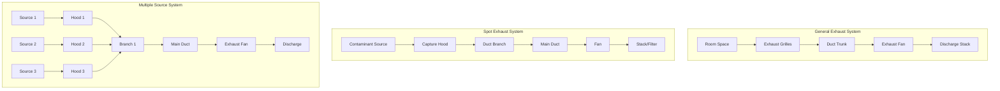
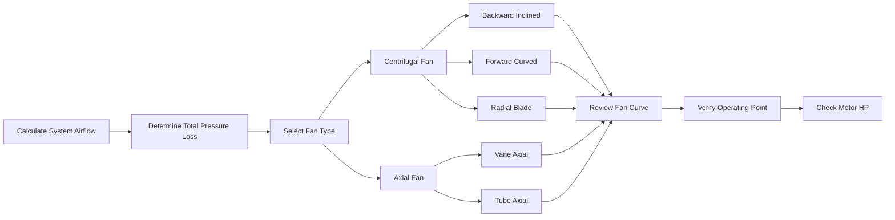

# Exhaust Systems Design and Implementation

Exhaust systems remove contaminated air, heat, moisture, and odors from building spaces, maintaining acceptable indoor air quality and occupant comfort. Proper design requires understanding airflow physics, contaminant characteristics, and system performance parameters.

## Types of Exhaust Systems

### General Exhaust Ventilation

General exhaust systems dilute and remove airborne contaminants uniformly distributed throughout a space. These systems rely on room air mixing to transport contaminants to exhaust points.

**Applications:**
- Office buildings and commercial spaces
- Restrooms and locker rooms
- Storage areas and mechanical rooms
- Light manufacturing facilities

General exhaust airflow requirements follow ASHRAE 62.1 minimum ventilation rates based on occupancy and floor area:

$$V_{\text{exhaust}} = R_p \times P + R_a \times A$$

Where:
- $V_{\text{exhaust}}$ = required exhaust airflow (cfm)
- $R_p$ = people outdoor air rate (cfm/person)
- $P$ = design occupant density (people)
- $R_a$ = area outdoor air rate (cfm/ft²)
- $A$ = floor area (ft²)

### Spot Exhaust Systems

Spot exhaust captures contaminants at or near their source before dispersal into the general space. This approach provides higher efficiency than general exhaust for localized sources.

**Common Applications:**
- Kitchen range hoods
- Laboratory fume hoods
- Welding stations
- Printing operations
- Soldering benches

Capture velocity determines the required exhaust flow rate based on hood configuration and contaminant characteristics:

$$Q = V_c \times A_{\text{face}}$$

Where:
- $Q$ = exhaust airflow (cfm)
- $V_c$ = capture velocity (fpm)
- $A_{\text{face}}$ = hood face area (ft²)

Typical capture velocities range from 50-200 fpm for canopy hoods to 100-500 fpm for lateral exhaust hoods, depending on contaminant thermal characteristics and generation rate.

### Process Exhaust Systems

Process exhaust systems handle industrial contaminants, hazardous materials, or high-temperature waste streams. These systems require specialized design to manage corrosive gases, explosive dusts, or toxic substances.

**Design Considerations:**
- Material compatibility with contaminants
- Explosion-proof construction when required
- Minimum transport velocities for particulates
- Spark-resistant construction for combustible dusts
- Corrosion-resistant materials for chemical processes

## Exhaust System Configuration

## Ductwork Sizing and Pressure Loss

Exhaust ductwork sizing balances initial cost against operating efficiency. Undersized ducts increase pressure loss and energy consumption; oversized ducts waste material and space.

### Velocity Selection

Recommended duct velocities depend on system type and transported materials:

| Application | Velocity Range (fpm) |
|-------------|---------------------|
| General exhaust | 1,200 - 1,800 |
| Kitchen grease-laden air | 1,500 - 2,000 |
| Light dust | 2,500 - 3,000 |
| Heavy dust | 3,500 - 4,500 |
| Abrasive materials | 4,500 - 5,500 |

### Pressure Loss Calculation

Total system pressure loss includes friction losses in straight duct, fitting losses, and exit losses:

$$\Delta P_{\text{total}} = \Delta P_{\text{friction}} + \Delta P_{\text{fittings}} + \Delta P_{\text{exit}}$$

Friction loss in straight duct:

$$\Delta P_{\text{friction}} = f \times \frac{L}{D} \times \frac{\rho V^2}{2}$$

Where:
- $f$ = friction factor (dimensionless)
- $L$ = duct length (ft)
- $D$ = duct diameter (ft)
- $\rho$ = air density (lbm/ft³)
- $V$ = air velocity (ft/s)

Fitting losses use loss coefficients:

$$\Delta P_{\text{fitting}} = C \times \frac{\rho V^2}{2}$$

Where $C$ is the fitting loss coefficient from ASHRAE Fundamentals.

## Fan Selection

### Fan Static Pressure

The fan must overcome total system pressure at design flow:

$$SP_{\text{fan}} = \Delta P_{\text{total}} + VP_{\text{discharge}}$$

Where:
- $SP_{\text{fan}}$ = fan static pressure (in. w.g.)
- $VP_{\text{discharge}}$ = velocity pressure at discharge (in. w.g.)

### Fan Power Requirement

Brake horsepower determines motor sizing:

$$\text{BHP} = \frac{Q \times SP_{\text{fan}}}{6356 \times \eta_{\text{fan}}}$$

Where:
- $\text{BHP}$ = brake horsepower
- $Q$ = airflow (cfm)
- $SP_{\text{fan}}$ = fan static pressure (in. w.g.)
- $\eta_{\text{fan}}$ = fan total efficiency (decimal)

Select motor horsepower 10-15% above calculated BHP to account for system variations and belt drive losses.

## System Balancing

Exhaust systems require balancing to achieve design airflows at each exhaust point:

1. **Measure actual flows** at each terminal using flow hood or pitot traverse
2. **Calculate adjustment** based on flow-pressure relationship: $Q_2/Q_1 = \sqrt{P_2/P_1}$
3. **Adjust dampers** at branches to redistribute airflow
4. **Verify fan performance** against manufacturer curves
5. **Document final settings** and flows for maintenance reference

## Design Standards and Guidelines

- **ASHRAE 62.1**: Ventilation for Acceptable Indoor Air Quality
- **ACGIH Industrial Ventilation Manual**: Hood design and capture velocities
- **NFPA 91**: Exhaust Systems for Air Conveying of Vapors, Gases, Mists, and Particulate Solids
- **IMC Chapter 5**: Exhaust Systems

## Critical Design Parameters

**Material Selection:**
- Galvanized steel for general exhaust
- Stainless steel for corrosive environments
- PVC or FRP for chemical exhaust
- Aluminum for abrasive materials (non-sparking)

**Discharge Location:**
- Minimum 10 ft above roof level
- 10 ft from air intakes
- Consider prevailing winds and building wake effects
- Rain caps for outdoor terminations

**Controls:**
- Variable speed drives for energy optimization
- Interlocked with supply air systems
- Pressure monitoring for system verification
- Alarm for inadequate exhaust flow

Proper exhaust system design integrates airflow calculations, material selection, fan performance, and control strategies to maintain safe, comfortable indoor environments while minimizing energy consumption.
