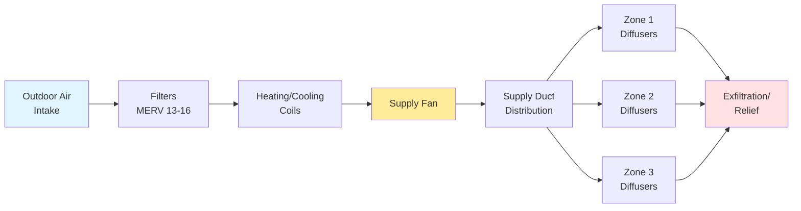
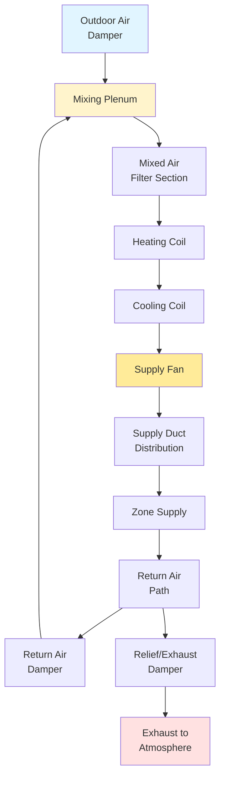
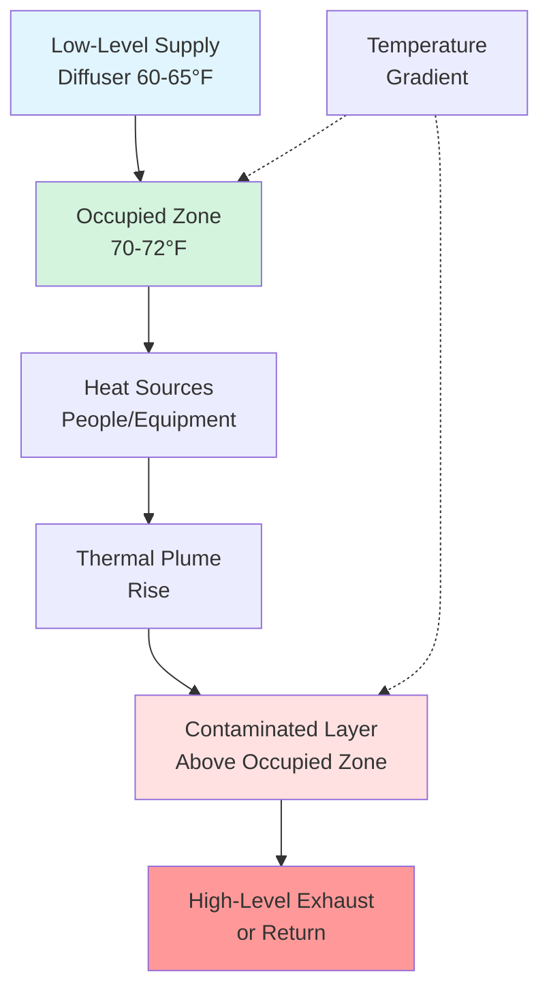

## Fundamental Operating Principle

Supply ventilation systems create **positive pressure** within the conditioned space by mechanically introducing air at a rate exceeding natural infiltration and exfiltration. This pressurization drives air outward through building envelope openings, preventing uncontrolled infiltration of unconditioned outdoor air, moisture, and contaminants.

The fundamental mass balance for a supply-only ventilation system:

$$\dot{m}_{\text{supply}} = \dot{m}_{\text{exhaust}} + \dot{m}_{\text{exfiltration}}$$

Where all mass flow rates are in lb/min or kg/s. The pressure differential created typically ranges from **0.02 to 0.05 in. w.g.** (5 to 12 Pa) relative to outdoors, sufficient to control infiltration without creating excessive building pressurization.

## System Configurations

### 100% Outdoor Air Systems

These systems supply entirely outdoor air without recirculation, providing maximum ventilation effectiveness and IAQ performance.

**Applications:**
- Healthcare facilities (operating rooms, isolation rooms)
- Laboratory environments with fume hood exhaust
- Industrial facilities with high contaminant generation
- Natatoriums requiring humidity control
- Spaces where cross-contamination is unacceptable

**Energy implications:**

Total conditioning energy for 100% OA system:

$$Q_{\text{total}} = 4.5 \times \text{cfm} \times \Delta h$$

Where:
- $Q_{\text{total}}$ = total cooling/heating load (Btu/hr)
- cfm = outdoor air supply rate
- $\Delta h$ = enthalpy difference between outdoor and supply air (Btu/lb)
- 4.5 = constant (60 min/hr × 0.075 lb/ft³)

**Example calculation:**
- Supply airflow: 10,000 cfm
- Summer outdoor: 95°F, 75°F WB (h = 38.3 Btu/lb)
- Supply condition: 55°F, 90% RH (h = 22.5 Btu/lb)

$$Q_{\text{total}} = 4.5 \times 10,000 \times (38.3 - 22.5) = 711,000 \text{ Btu/hr (59.3 tons)}$$

This high energy demand necessitates energy recovery in most climates, achieving 60-80% reduction in conditioning loads.

### Mixed Air Systems

Mixed air systems combine outdoor air with recirculated return air, reducing energy consumption while maintaining required ventilation rates.

**Outdoor air percentage calculation:**

The fraction of outdoor air in the supply airstream:

$$\%OA = \frac{V_{oa}}{V_{sa}} \times 100$$

Where:
- $\%OA$ = outdoor air percentage
- $V_{oa}$ = outdoor air intake rate (cfm)
- $V_{sa}$ = total supply air rate (cfm)

**Alternative calculation using temperature or CO₂ measurement:**

$$\%OA = \frac{T_{ma} - T_{ra}}{T_{oa} - T_{ra}} \times 100$$

Where:
- $T_{ma}$ = mixed air temperature (°F)
- $T_{ra}$ = return air temperature (°F)
- $T_{oa}$ = outdoor air temperature (°F)

**Example:**
- Return air: 75°F
- Outdoor air: 95°F
- Mixed air: 79°F

$$\%OA = \frac{79 - 75}{95 - 75} \times 100 = \frac{4}{20} \times 100 = 20\%$$

If supply airflow is 20,000 cfm, outdoor air intake is 4,000 cfm.

## ASHRAE 62.1 Ventilation Rate Procedure

ASHRAE Standard 62.1 defines minimum outdoor air requirements for acceptable indoor air quality based on occupancy and space function.

**Zone outdoor air requirement:**

$$V_{oz} = R_p P_z + R_a A_z$$

Where:
- $V_{oz}$ = outdoor air requirement for zone (cfm)
- $R_p$ = outdoor air rate per person (cfm/person)
- $P_z$ = zone population (design occupancy)
- $R_a$ = outdoor air rate per unit area (cfm/ft²)
- $A_z$ = zone floor area (ft²)

**System-level outdoor air intake:**

For multiple-zone systems, account for ventilation effectiveness and distribution efficiency:

$$V_{ot} = \frac{\sum_{all\,zones} V_{oz}/E_z}{1 - \frac{\sum_{all\,zones} V_{oz}/E_z}{V_{ps}}}$$

Where:
- $V_{ot}$ = outdoor air intake at system level (cfm)
- $E_z$ = zone air distribution effectiveness (typically 0.8-1.2)
- $V_{ps}$ = system primary airflow (cfm)

**Practical example:**

Office building with three zones:

| Zone | Area (ft²) | Occupants | $R_p$ (cfm/person) | $R_a$ (cfm/ft²) | $V_{oz}$ (cfm) |
|------|-----------|-----------|-------------------|----------------|---------------|
| Zone 1 | 2,000 | 10 | 5 | 0.06 | 170 |
| Zone 2 | 3,000 | 15 | 5 | 0.06 | 255 |
| Zone 3 | 1,500 | 8 | 5 | 0.06 | 130 |
| **Total** | **6,500** | **33** | - | - | **555 cfm** |

Assuming $E_z = 1.0$ (ceiling supply, floor return) and total supply airflow of 6,000 cfm:

$$V_{ot} = \frac{555}{1 - \frac{555}{6,000}} = \frac{555}{0.908} = 611 \text{ cfm}$$

System outdoor air fraction: $611/6,000 = 10.2\%$

## Air Distribution Strategies

### Mixing Ventilation

Conventional overhead supply creates **fully mixed conditions** within the occupied zone through high-velocity air jets that induce room air entrainment.

**Design parameters:**
- Supply air temperature: 55-65°F (cooling), 85-105°F (heating)
- Supply velocity at diffuser: 400-800 fpm
- Terminal velocity at occupied zone: <50 fpm
- Air changes per hour: 4-12 ACH (varies by application)

**Throw calculation:**

Throw distance to specified terminal velocity:

$$T = \frac{V_o}{V_t} \times d_o \times K$$

Where:
- $T$ = throw distance (ft)
- $V_o$ = outlet velocity (fpm)
- $V_t$ = terminal velocity (fpm, typically 50 fpm)
- $d_o$ = outlet diameter or effective dimension (ft)
- $K$ = diffuser constant (0.8-1.5, manufacturer data)

**Example:**
- Round ceiling diffuser: 12 in. diameter (1.0 ft)
- Outlet velocity: 600 fpm
- Terminal velocity: 50 fpm
- K factor: 1.2

$$T = \frac{600}{50} \times 1.0 \times 1.2 = 14.4 \text{ ft}$$

This throw must reach at least **two-thirds to three-quarters** of the distance to the nearest wall or adjacent diffuser for proper mixing.

### Displacement Ventilation

Low-velocity air supply at floor level creates **vertical stratification** with cool supply air displacing warm, contaminated air upward.

**Design criteria:**
- Supply air velocity: <50 fpm at diffuser face
- Supply air temperature: 2-7°F below space temperature
- Vertical temperature gradient: 1-3°F per 3 ft of height
- Supply rate: 0.5-1.0 cfm/ft² floor area

**Cooling capacity limitation:**

$$q_{\text{max}} = 1.08 \times \text{cfm} \times \Delta T$$

For 1.0 cfm/ft² and 7°F temperature difference:

$$q_{\text{max}} = 1.08 \times 1.0 \times 7 = 7.56 \text{ Btu/(hr·ft²)}$$

This limits displacement ventilation to **low sensible load spaces** (15-30 Btu/(hr·ft²) maximum).

### Underfloor Air Distribution (UFAD)

Supply air delivered through floor-mounted diffusers from a pressurized underfloor plenum combines aspects of both displacement and mixing ventilation.

**System characteristics:**
- Plenum pressure: 0.05-0.15 in. w.g.
- Supply temperature: 60-68°F (warmer than conventional)
- Airflow per diffuser: 25-100 cfm
- Stratification height: 4-6 ft above floor
- Individual zone control at each diffuser

**Plenum pressure calculation:**

$$\Delta P = \frac{12 \rho V^2}{2 g_c} \times \left(\frac{L}{D_h} f + \Sigma K\right)$$

Where:
- $\Delta P$ = pressure drop (in. w.g.)
- $\rho$ = air density (lb/ft³)
- $V$ = velocity (ft/s)
- $L$ = plenum travel distance (ft)
- $D_h$ = hydraulic diameter of plenum (ft)
- $f$ = friction factor
- $\Sigma K$ = sum of fitting losses

## Diffuser Selection Methodology

### Cooling Load and Airflow Determination

Required supply airflow for sensible cooling:

$$\text{cfm} = \frac{Q_s}{1.08 \times \Delta T}$$

Where:
- $Q_s$ = sensible cooling load (Btu/hr)
- $\Delta T$ = supply-to-space temperature difference (°F)

**Example:**
- Zone sensible load: 18,000 Btu/hr
- Space temperature: 75°F
- Supply temperature: 55°F

$$\text{cfm} = \frac{18,000}{1.08 \times (75 - 55)} = \frac{18,000}{21.6} = 833 \text{ cfm}$$

### Diffuser Sizing Criteria

**Neck velocity check:**

$$V_{\text{neck}} = \frac{\text{cfm}}{A_{\text{neck}} \times 144}$$

Where $A_{\text{neck}}$ is diffuser neck area (in²). Maintain neck velocity:
- Ceiling diffusers: 400-700 fpm (NC 25-35)
- Sidewall grilles: 300-500 fpm (NC 25-30)
- Slot diffusers: 500-800 fpm (NC 30-40)

**Throw distance verification:**

Select diffuser size and type to achieve proper throw for ceiling height:

| Ceiling Height | Recommended Throw | Terminal Velocity |
|----------------|-------------------|-------------------|
| 8-9 ft | 0.75 × room length | 50 fpm |
| 10-14 ft | 0.67 × room length | 75 fpm |
| 15-20 ft | 0.50 × room length | 100 fpm |

**Pressure drop allocation:**

Total system pressure budget distributes across components:

| Component | Typical Pressure Drop |
|-----------|----------------------|
| Diffusers | 0.03-0.10 in. w.g. |
| VAV boxes | 0.25-0.50 in. w.g. |
| Ductwork | 0.10 per 100 ft |
| Filters | 0.20-0.50 in. w.g. |
| Coils | 0.30-0.80 in. w.g. |
| **Total** | **2.0-4.0 in. w.g.** |

## Control Strategies

**Constant volume supply:**
- Fixed airflow rate regardless of load
- Modulate supply air temperature for load control
- Simple control, higher energy consumption
- Typical applications: small systems, process ventilation

**Variable air volume (VAV):**
- Modulate airflow to match thermal load
- Minimum airflow setpoint maintains ventilation
- Energy efficient, complex control
- Requires outdoor air tracking to maintain ventilation rates

**Minimum outdoor air control:**

Monitor and modulate outdoor air dampers to maintain required $V_{oz}$:

$$V_{oa,\text{min}} = \max\left(V_{oz}, 0.15 \times V_{sa}\right)$$

Ensures outdoor air fraction never drops below minimum code requirement (typically 15%) even at low supply airflow.

**Supply air temperature reset:**

Increase supply temperature during partial loads to reduce overcooling and reheat:

$$T_{sa,\text{reset}} = T_{sa,\text{design}} + k \times (T_{oa} - T_{oa,\text{design}})$$

Where $k$ is reset ratio (typically 0.25-0.50), allowing supply temperature to warm from 55°F to 60-62°F during mild conditions.

## Performance Verification

**Airflow measurement:**
- Pitot tube traverse in duct: ±5% accuracy
- Calibrated balancing hood at diffuser: ±10% accuracy
- Hot-wire anemometer: ±3% accuracy for velocity

**Pressure differential verification:**
- Measure building-to-outdoor pressure at multiple locations
- Target: 0.02-0.05 in. w.g. positive
- Avoid excessive pressurization (>0.08 in. w.g.) causing door operation issues

**Ventilation effectiveness testing:**
- Tracer gas decay method (ASTM E741)
- CO₂ concentration monitoring
- Age of air distribution measurement

Supply ventilation systems provide effective space pressurization and ventilation delivery when properly designed with attention to outdoor air intake rates, air distribution patterns, and control strategies that maintain code-required ventilation under all operating conditions.

---

**File:** /Users/evgenygantman/Documents/github/gantmane/hvac/content/ventilation-indoor-air-quality/ventilation-systems/mechanical-ventilation/supply-systems/_index.md
