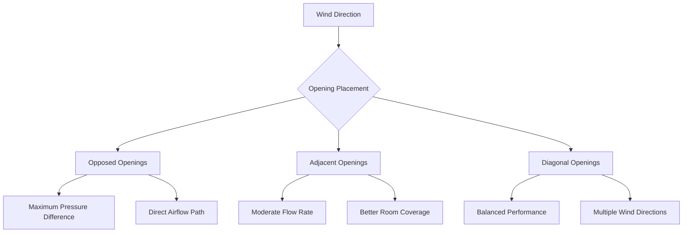
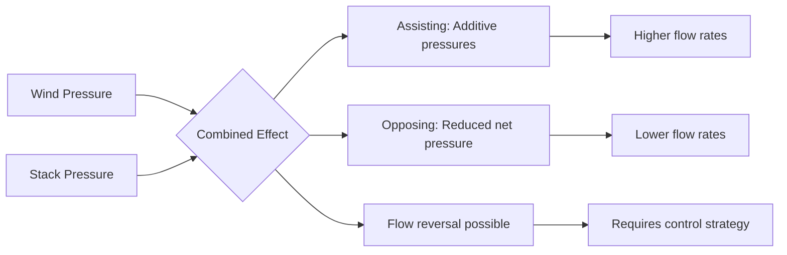

## Overview

Cross-ventilation leverages wind-induced pressure differentials across building facades to generate natural airflow through occupied spaces. This passive ventilation strategy provides cooling, fresh air delivery, and contaminant removal without mechanical energy when properly designed for local wind patterns and building geometry.

Effective cross-ventilation requires quantitative analysis of wind pressures, strategic opening placement, and understanding of internal airflow patterns to achieve target ventilation rates and thermal comfort.

## Wind Pressure Fundamentals

### Dynamic Wind Pressure

Wind velocity creates kinetic energy that converts to pressure at building surfaces according to Bernoulli's principle:

$$q = \frac{1}{2} \rho V^2$$

Where:
- $q$ = dynamic wind pressure (Pa)
- $\rho$ = air density (1.2 kg/m³ at sea level, 20°C)
- $V$ = wind velocity (m/s)

This dynamic pressure forms the basis for all wind-driven ventilation calculations.

### Surface Pressure Distribution

Wind creates non-uniform pressure distributions on building surfaces based on flow separation and reattachment patterns:

$$P_{surface} = C_p \cdot q$$

Where:
- $P_{surface}$ = gauge pressure on surface (Pa)
- $C_p$ = wind pressure coefficient (dimensionless)

The pressure coefficient represents the ratio of local pressure to reference dynamic pressure and varies with building geometry, wind direction, and local flow conditions.

## Wind Pressure Coefficients

### Typical Values for Rectangular Buildings

| Surface | Wind Angle | $C_p$ Range | Design Value |
|---------|-----------|-------------|--------------|
| Windward facade | 0° (perpendicular) | +0.5 to +0.8 | +0.6 |
| Leeward facade | 180° (opposite) | -0.3 to -0.5 | -0.4 |
| Side walls | 90° (parallel) | -0.6 to -0.8 | -0.7 |
| Roof windward | 0-15° slope | -0.7 to -0.3 | -0.5 |
| Roof leeward | 0-15° slope | -0.5 to -0.3 | -0.4 |

### Influencing Factors

**Building Geometry:**
Sharp corners create higher negative pressures (down to $C_p = -1.2$) while rounded edges moderate pressure variations.

**Urban Context:**
Surrounding buildings reduce windward positive pressures by 20-40% and alter pressure patterns through shielding and channeling effects.

**Roof Configuration:**
Pitched roofs shift pressure distributions compared to flat roofs, with steeper slopes generating stronger leeward suction.

**Opening Location:**
Pressure coefficients vary vertically due to velocity gradients and horizontally due to flow separation zones. Values near corners differ significantly from mid-facade locations.

## Cross-Ventilation Airflow Calculation

### Single-Opening Pressure Difference

For a building with inlet and outlet openings subjected to different wind pressures:

$$\Delta P_{wind} = C_p \cdot \frac{1}{2} \rho V^2 = (C_{p,inlet} - C_{p,outlet}) \cdot \frac{1}{2} \rho V^2$$

This pressure differential drives airflow through the building according to orifice flow principles.

### Volumetric Flow Rate

The airflow through cross-ventilated spaces with multiple openings:

$$Q = C_d \cdot A_{eff} \cdot \sqrt{\frac{2 \Delta P}{\rho}}$$

For wind-driven flow with known pressure coefficients:

$$Q = C_d \cdot A_{eff} \cdot V_{ref} \sqrt{|C_{p,inlet} - C_{p,outlet}|}$$

Where:
- $Q$ = volumetric flow rate (m³/s)
- $C_d$ = discharge coefficient (0.6-0.65 for sharp edges, 0.8 for rounded edges)
- $A_{eff}$ = effective opening area (m²)
- $V_{ref}$ = reference wind velocity at building height (m/s)
- $\Delta P$ = pressure difference across openings (Pa)

### Effective Opening Area

When multiple openings exist in series (typical cross-ventilation configuration):

$$A_{eff} = \frac{1}{\sqrt{\frac{1}{A_1^2} + \frac{1}{A_2^2} + \frac{1}{A_3^2} + \cdots}}$$

For the common two-opening case (inlet and outlet):

$$A_{eff} = \frac{A_{inlet} \cdot A_{outlet}}{\sqrt{A_{inlet}^2 + A_{outlet}^2}}$$

This relationship demonstrates that the smaller opening dominates flow resistance. When inlet and outlet areas are equal, $A_{eff} = A/\sqrt{2} \approx 0.71A$.

## Opening Configuration Strategies

### Inlet-Outlet Positioning

**Opposed Openings (0-180° placement):**
Maximizes pressure differential ($\Delta C_p \approx 1.0$) and achieves highest flow rates. Creates focused airstream through space with potential for dead zones away from flow path.

**Adjacent Openings (90° placement):**
Reduces pressure differential ($\Delta C_p \approx 0.6-0.8$) but improves airflow distribution within space. Better for variable wind directions.

**Diagonal Openings (120-150° placement):**
Compromises between maximum flow rate and distribution uniformity. Effective for buildings with multiple prevailing wind directions.

### Sizing Relationships

| Configuration | Area Ratio (Inlet:Outlet) | Flow Efficiency | Application |
|--------------|------------------------------|-----------------|-------------|
| Equal area | 1:1 | 100% (baseline) | Maximum ventilation rate |
| Inlet-limited | 1:1.5 | 94% | Reduced inlet velocity, lower drafts |
| Inlet-limited | 1:2 | 89% | Minimum inlet drafts |
| Outlet-limited | 1.5:1 | 94% | Higher interior velocities |
| Outlet-limited | 2:1 | 89% | Enhanced mixing, short-circuit risk |

ASHRAE Fundamentals recommends inlet areas equal to or greater than outlet areas to maintain adequate flow rates while limiting excessive inlet velocities.

### Vertical Positioning

**Floor-Level Inlets:**
Introduce cooler outdoor air at occupied zone level, effective for warm climates. Risk of dust and water ingress requires protective design.

**Head-Height Inlets:**
Balance between fresh air delivery and draft avoidance. Standard for office and residential applications.

**High-Level Inlets with Low Outlets:**
Create downward displacement flow, effective when outdoor air is cooler than indoor air.

**Low Inlets with High-Level Outlets:**
Natural buoyancy-assisted flow removes warm air and contaminants. Combines stack effect with wind pressure.

## Internal Airflow Patterns

### Flow Path Geometry

The actual airflow path through a space differs from the direct geometric line between openings due to:

1. **Momentum effects:** Air entering with velocity maintains directional bias
2. **Thermal buoyancy:** Temperature differences deflect flow vertically
3. **Obstructions:** Furniture and partitions redirect and diffuse flow
4. **Boundary layers:** Wall friction reduces near-surface velocities

### Velocity Distribution

Average velocity through occupied zone approximates:

$$V_{zone} = \frac{Q}{A_{cross-section}} \cdot k$$

Where:
- $V_{zone}$ = average air velocity in occupied zone (m/s)
- $A_{cross-section}$ = cross-sectional area perpendicular to flow (m²)
- $k$ = distribution factor (0.4-0.7 depending on obstructions)

Peak velocities near openings can reach 2-3 times the average, while stagnant zones may experience less than 20% of average velocity.

### Short-Circuiting

Direct flow paths from inlet to outlet that bypass significant room volume reduce ventilation effectiveness. Short-circuiting occurs when:

- Openings align directly with minimal separation distance
- Large outlet area relative to inlet creates low-resistance path
- Vertical temperature stratification channels flow at ceiling level

Mitigation strategies include offset opening placement, interior baffles, or partitions to redirect airflow through occupied zones.

## Air Change Effectiveness

### Ventilation Effectiveness Metric

Local air change effectiveness at a point:

$$\varepsilon_a = \frac{C_{exhaust} - C_{supply}}{C_{point} - C_{supply}}$$

Where:
- $\varepsilon_a$ = air change effectiveness (dimensionless)
- $C_{exhaust}$ = contaminant concentration at exhaust
- $C_{supply}$ = contaminant concentration at supply
- $C_{point}$ = contaminant concentration at measurement point

For perfect mixing, $\varepsilon_a = 1.0$. Values below 0.5 indicate poor ventilation effectiveness, while values above 1.5 suggest displacement ventilation characteristics.

### Age of Air

Mean age of air quantifies the average time air has resided in the space:

$$\bar{\tau}_p = \int_0^\infty [1 - F(t)] dt$$

Where:
- $\bar{\tau}_p$ = mean age of air at point (seconds)
- $F(t)$ = cumulative distribution of air age

For cross-ventilation with good mixing, nominal time constant:

$$\bar{\tau}_n = \frac{V}{Q}$$

Where:
- $V$ = room volume (m³)
- $Q$ = ventilation flow rate (m³/s)

Actual age of air in poorly mixed spaces can exceed nominal time constant by factors of 2-4 in stagnant zones.

## Design Wind Speed Selection

### Reference Height Correction

Meteorological wind speeds measured at standard 10-meter height require adjustment to building height:

$$V_h = V_{10} \left(\frac{h}{10}\right)^\alpha$$

Where:
- $V_h$ = wind speed at height $h$ (m/s)
- $V_{10}$ = wind speed at 10 m reference height (m/s)
- $h$ = building height (m)
- $\alpha$ = terrain roughness exponent

| Terrain Category | Description | Roughness $\alpha$ |
|-----------------|-------------|-------------------|
| I | Open water, flat terrain | 0.10 |
| II | Rural, scattered obstructions | 0.15 |
| III | Suburban, wooded areas | 0.20 |
| IV | Urban, city centers | 0.25-0.30 |

### Design Wind Speed Selection

**ASHRAE Approach:**
Use 50th percentile wind speed (median) from historical data for typical operation analysis. Use 10th percentile for minimum performance verification.

**Summer vs. Winter:**
Analyze separately as prevailing wind directions and speeds vary seasonally. Summer winds typically govern cooling ventilation design.

**Directional Frequency:**
Weight pressure coefficients by wind direction frequency to calculate effective average ventilation rates across variable wind conditions.

## Combined Stack and Wind Effects

### Simultaneous Pressure Components

Both stack effect and wind pressure act simultaneously in natural ventilation:

$$\Delta P_{total} = \Delta P_{wind} + \Delta P_{stack}$$

$$\Delta P_{total} = (C_{p,inlet} - C_{p,outlet}) \frac{\rho V^2}{2} + \rho g h \frac{\Delta T}{T_{avg}}$$

Where terms are defined in previous sections.

### Flow Direction Analysis

Wind and stack effects can assist or oppose each other depending on opening configuration and temperature conditions:

**Assisting Configuration:**
Windward inlet at lower level, leeward outlet at upper level. Both wind positive pressure and stack effect drive upward flow. Maximum ventilation rate.

**Opposing Configuration:**
Windward inlet at upper level, leeward outlet at lower level. Wind drives downward flow while stack effect drives upward flow. Net effect depends on dominant force.

### Dominant Force Determination

The relative magnitude of wind and stack effects:

$$R = \frac{\Delta P_{wind}}{\Delta P_{stack}} = \frac{(C_{p,inlet} - C_{p,outlet}) V^2}{2 g h \Delta T / T_{avg}}$$

- $R > 3$: Wind dominates, stack effect negligible
- $0.3 < R < 3$: Both effects significant, careful analysis required
- $R < 0.3$: Stack effect dominates, wind effect secondary

For typical low-rise buildings (h = 3-5 m) with moderate temperature differences (ΔT = 5 K) and wind speeds exceeding 2 m/s, wind effects dominate cross-ventilation performance.

## CFD Validation and Limitations

### When CFD Analysis is Warranted

Computational Fluid Dynamics provides detailed velocity and temperature predictions for:

- Complex building geometries with irregular opening patterns
- Urban contexts with surrounding building influences
- Internal spaces with significant obstructions or partitions
- Validation of simplified hand calculations
- Optimization of opening sizes and locations

### Turbulence Modeling Requirements

**RANS Models:**
Reynolds-Averaged Navier-Stokes models (k-ε, k-ω, SST) suitable for steady-state analysis. Computational efficiency allows parametric studies.

**LES Models:**
Large Eddy Simulation captures transient flow features and separation zones more accurately but requires significantly greater computational resources.

**Domain Size:**
Minimum 5H upstream, 15H downstream, and 5H lateral from building (where H = building height) to avoid boundary influence.

### Validation Data Requirements

CFD predictions require validation against:
- Wind tunnel testing for pressure coefficient distributions
- Full-scale measurements in comparable buildings
- Tracer gas testing for age of air and ventilation effectiveness

ASHRAE Standard 140 provides test cases for natural ventilation model validation.

## Practical Design Limitations

### Thermal Comfort Boundaries

Air velocity constraints for occupant comfort:

| Activity Level | Temperature Range | Maximum Velocity | Application |
|---------------|------------------|-----------------|-------------|
| Sedentary | 20-24°C | 0.15 m/s | Winter, mechanical backup |
| Sedentary | 25-27°C | 0.5 m/s | Summer, natural ventilation |
| Light office work | 20-24°C | 0.25 m/s | Standard comfort range |
| Light office work | 25-28°C | 0.8 m/s | Elevated air movement acceptable |

ASHRAE Standard 55 adaptive comfort model allows higher velocities when occupants have control and temperatures exceed 25°C.

### Reliability Concerns

Cross-ventilation performance depends on unpredictable wind conditions:

- **Calm periods:** Insufficient driving force requires mechanical backup
- **Excessive wind:** Over-ventilation causes discomfort, noise, and door operation issues
- **Variable direction:** Off-design wind angles reduce pressure differentials by 40-70%
- **Seasonal patterns:** Summer calm periods often coincide with peak cooling demand

### Integration Requirements

Effective cross-ventilation requires:

- **Automated window/damper control:** Respond to wind speed, direction, and indoor conditions
- **Weather monitoring:** Real-time wind speed and direction sensors integrated with BMS
- **Mechanical backup:** Maintain minimum IAQ ventilation during unfavorable conditions (typically 0.3 L/s/m² per ASHRAE 62.1)
- **Security and rain protection:** Address concerns that limit window opening

## Design Process Framework

1. **Analyze Wind Climate:**
   - Obtain directional wind speed data (wind rose)
   - Identify prevailing wind directions for cooling season
   - Determine design wind speeds (median and 10th percentile)

2. **Establish Opening Strategy:**
   - Position inlets on windward facades based on prevailing winds
   - Position outlets on leeward or side facades for maximum $\Delta C_p$
   - Consider multiple wind directions if no strong prevailing pattern exists

3. **Calculate Required Opening Areas:**
   - Determine required ventilation rate from ASHRAE 62.1 or local codes
   - Apply effective area equation with target wind speed
   - Size openings with appropriate inlet-outlet ratio (typically 1:1 to 1:1.5)

4. **Verify Air Velocities:**
   - Calculate average zone velocity from flow rate and cross-section
   - Confirm velocities within comfort limits for occupied zones
   - Assess peak velocities near openings for draft potential

5. **Assess Ventilation Effectiveness:**
   - Evaluate flow path geometry for short-circuiting potential
   - Consider CFD analysis for complex spaces
   - Plan for mixing enhancement if needed (ceiling fans, internal partitions)

6. **Design Control Strategy:**
   - Specify automated actuators for responsive opening control
   - Define transition criteria for mechanical backup activation
   - Integrate with building management system for coordinated operation

Cross-ventilation provides energy-efficient fresh air delivery and cooling when outdoor conditions align with comfort requirements and sufficient wind resources exist. Quantitative analysis of wind pressures, proper opening configuration, and realistic assessment of airflow patterns enable effective passive ventilation design.

---

**References:**
ASHRAE Fundamentals Handbook, Chapter 16: Ventilation and Infiltration
ASHRAE Standard 55: Thermal Environmental Conditions for Human Occupancy
ASHRAE Standard 62.1: Ventilation for Acceptable Indoor Air Quality
CIBSE AM10: Natural Ventilation in Non-Domestic Buildings
