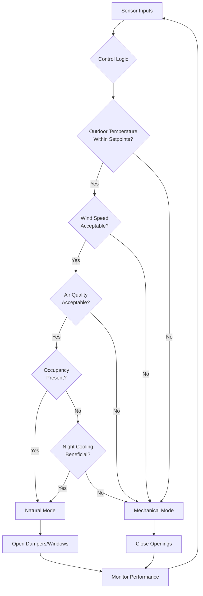
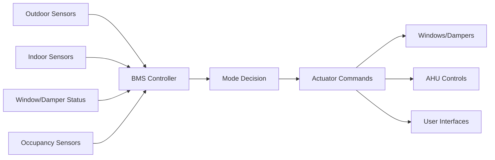

# Hybrid Ventilation Systems

Hybrid ventilation (also termed mixed-mode ventilation) integrates natural and mechanical ventilation strategies within a single building system, switching between or combining modes to optimize energy performance, indoor air quality, and occupant comfort. This approach leverages the energy-free benefits of natural ventilation when outdoor conditions permit while maintaining mechanical backup for periods of inadequate natural driving forces or unfavorable external environments.

## Fundamental Operating Modes

Hybrid ventilation systems operate in three distinct configurations:

**Complementary Mode**: Natural and mechanical ventilation operate simultaneously in different zones or at different times. For example, perimeter zones may use operable windows while core zones rely on mechanical supply, or natural ventilation may serve during occupied hours with mechanical night purge.

**Changeover Mode**: The system switches entirely between natural and mechanical ventilation based on outdoor conditions, indoor requirements, or occupancy patterns. Control algorithms determine the optimal mode and execute the transition.

**Zoned Mode**: Different building zones operate in different modes simultaneously, with spatial segregation between naturally ventilated and mechanically conditioned areas. This typically involves dedicated perimeter zones with operable facades and mechanically served core zones.

## Changeover Control Strategies

Effective changeover control requires sophisticated algorithms that balance multiple competing factors:

**Temperature-Based Changeover**: The most common strategy switches to natural mode when outdoor temperature falls within a deadband typically 2-4°F narrower than the mechanical cooling setpoint. ASHRAE recommends a natural ventilation range of 64-78°F (18-26°C) for typical commercial applications.

**Enthalpy-Based Control**: More sophisticated systems compare outdoor and indoor enthalpy (combined temperature and humidity) to determine when outdoor air provides a thermodynamic advantage. This prevents introducing humid outdoor air that increases latent cooling loads.

**Predictive Control**: Advanced systems incorporate weather forecasts and building thermal mass models to predict optimal switching times. Pre-cooling with night ventilation may allow extended natural mode operation the following day.

## Sensor Integration Architecture

Critical sensor requirements include:

**Outdoor Sensors**: Temperature, humidity, wind speed and direction, precipitation detection, and air quality (PM2.5, CO2, NOx) at building perimeter locations representative of ventilation intake conditions.

**Indoor Sensors**: Temperature and humidity in representative zones, CO2 concentration for demand-based ventilation, VOC sensors in high-sensitivity applications, and differential pressure across the building envelope.

**System Status Sensors**: Position feedback from motorized windows and dampers, airflow stations in mechanical supply ducts, fan status indicators, and occupancy sensors for zone-level control.

## Energy Performance and Comfort Balance

Hybrid ventilation achieves energy savings through three mechanisms:

**Fan Energy Reduction**: Natural ventilation eliminates supply and return fan operation, typically reducing HVAC electrical consumption by 30-50% during applicable hours. A 50,000 CFM system with 2.5 in. w.g. total static pressure requires approximately 35 kW fan power. Annual operating hours in natural mode directly translate to kWh savings.

**Cooling Load Avoidance**: Free cooling with outdoor air reduces or eliminates mechanical cooling loads when outdoor conditions are favorable. The magnitude depends on climate, internal gains, and building thermal mass. Mixed-humid climates typically achieve 500-1000 cooling degree-day-hour reductions annually.

**Thermal Mass Utilization**: Night ventilation purges heat stored in building thermal mass, reducing the following day's cooling load. Concrete structures with 4-6 in. exposed slab thickness can store 8-12 Btu/ft² per °F temperature swing, providing substantial passive cooling capacity.

## Design Considerations

**Facade Integration**: Hybrid systems require coordinated design of operable elements (windows, louvers, dampers) with mechanical distribution. Automated window systems must integrate with BMS controls, include rain sensors for automatic closure, and provide manual override capability per occupant preference studies.

**Acoustic Performance**: Natural ventilation openings compromise acoustic isolation. Urban locations or sites near transportation corridors require acoustic attenuation strategies including sound-rated automated dampers, acoustic louvers with 15-25 dB insertion loss, or temporal restrictions limiting natural mode to low-noise periods.

**Air Quality Management**: Natural ventilation admits unfiltered outdoor air. Sites with elevated particulate matter, ozone, or allergen concentrations may require auxiliary filtration, restricted operating schedules, or real-time air quality monitoring with automatic changeover to mechanical mode when outdoor concentrations exceed thresholds.

**Control Authority and Override**: Occupant control significantly impacts comfort satisfaction but can compromise system optimization. Successful implementations provide local override capability within preset ranges (typically 15-30 minute duration) while maintaining centralized authority for health and safety functions.

## Standards and Guidelines

**ASHRAE Standard 62.1** addresses hybrid ventilation in the natural ventilation procedure (Section 6.4), requiring engineered calculations or analytical methods demonstrating adequate ventilation rates. The standard permits combining natural and mechanical ventilation provided minimum outdoor air requirements are continuously maintained.

**CIBSE Applications Manual AM13** (Mixed Mode Ventilation) provides comprehensive design guidance including control strategies, component selection, and commissioning procedures. CIBSE recommends deadband widths, sensor locations, and changeover timing protocols based on building type and climate.

**CIBSE Applications Manual AM10** (Natural Ventilation in Non-Domestic Buildings) establishes natural ventilation design methods applicable to hybrid system natural-mode operation, including airflow calculation procedures and opening sizing criteria.

## Performance Validation

Commissioning hybrid systems requires verification of both natural and mechanical modes plus transition behavior. Functional performance tests should confirm sensor calibration, control logic sequences, actuator response times (typically 2-5 minutes for automated windows), and interlock functionality preventing simultaneous mechanical cooling and natural ventilation.

Post-occupancy monitoring should track mode selection patterns, energy consumption by mode, indoor environmental quality parameters, and occupant satisfaction. Continuous commissioning may reveal opportunities to expand natural mode operating envelopes based on actual performance data and occupant feedback.

---

**Related Topics**: Natural Ventilation, Stack Effect, Wind-Driven Ventilation, Building Automation Systems, Energy Recovery Ventilation, Demand Controlled Ventilation
