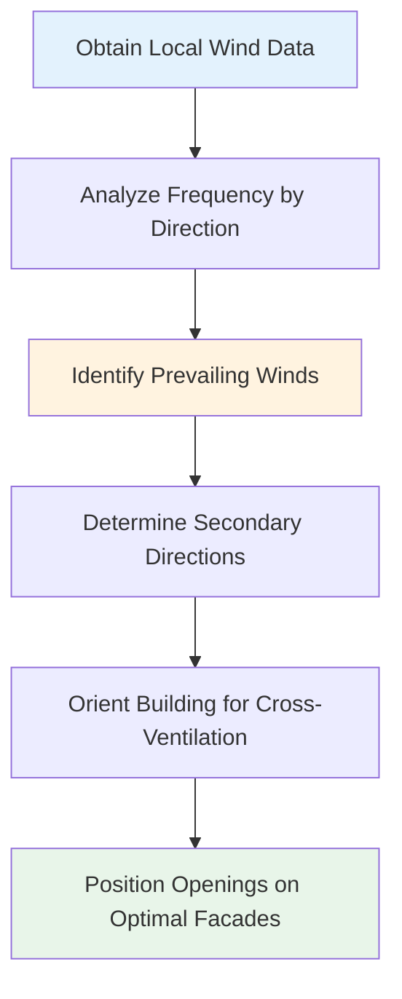

# Wind-Driven Natural Ventilation

Wind-driven ventilation exploits differential pressure across building facades to induce airflow through openings. This mechanism relies on the conversion of wind kinetic energy into static pressure at building surfaces, creating pressure gradients that drive air movement.

## Physical Principles

Wind impinging on a building creates positive pressure on windward surfaces and negative pressure on leeward and side surfaces. The pressure distribution depends on wind velocity, building geometry, and surrounding terrain.

The surface pressure at any point is characterized by:

$$
P_s = P_{\infty} + C_p \cdot \frac{1}{2} \rho V^2
$$

Where:
- $P_s$ = surface pressure (Pa)
- $P_{\infty}$ = reference atmospheric pressure (Pa)
- $C_p$ = pressure coefficient (dimensionless)
- $\rho$ = air density (kg/m³)
- $V$ = reference wind velocity (m/s)

The pressure coefficient $C_p$ varies with position on the building surface, wind direction, and building geometry. Values typically range from +0.8 on windward faces to -0.6 on leeward faces.

## Pressure Coefficients

ASHRAE Fundamentals provides guidance on pressure coefficient values for ventilation design. Representative values for rectangular buildings:

| Surface Location | $C_p$ Range | Design Value |
|-----------------|-------------|--------------|
| Windward wall (perpendicular) | +0.5 to +0.8 | +0.6 |
| Leeward wall | -0.3 to -0.5 | -0.4 |
| Side walls | -0.6 to -0.8 | -0.65 |
| Roof windward edge | -0.7 to -0.9 | -0.8 |
| Roof leeward | -0.3 to -0.5 | -0.4 |

These values apply to isolated buildings in open terrain. Urban environments and building clusters significantly modify local pressure distributions.

## Airflow Calculation

For cross-ventilation through two openings (inlet and outlet), the volumetric flow rate is:

$$
Q = C_d \cdot A_{eff} \cdot V \cdot \sqrt{C_{p1} - C_{p2}}
$$

Where:
- $Q$ = volumetric flow rate (m³/s)
- $C_d$ = discharge coefficient (typically 0.6-0.65)
- $A_{eff}$ = effective opening area (m²)
- $V$ = reference wind velocity (m/s)
- $C_{p1}$, $C_{p2}$ = pressure coefficients at inlet and outlet

The effective area accounts for multiple openings in series:

$$
\frac{1}{A_{eff}^2} = \frac{1}{A_1^2} + \frac{1}{A_2^2}
$$

For multiple openings, the inlet opening typically governs when $A_{inlet} < A_{outlet}$.

## Cross-Ventilation Design

Effective cross-ventilation requires careful consideration of opening placement, sizing, and internal flow paths.

### Design Guidelines

**Opening Placement:**
- Position inlet openings on windward facade at occupant height
- Locate outlet openings on leeward or side facades, preferably higher than inlets
- Maximize separation distance between inlet and outlet to increase ventilation effectiveness
- Avoid obstructions in flow path between openings

**Opening Sizing:**
- Size outlet area equal to or larger than inlet area
- Minimum 4% of floor area for openings in temperate climates (ASHRAE Standard 62.1 exception)
- Consider insect screens reducing effective area by 40-60%

**Internal Configuration:**
- Minimize internal partitions obstructing flow path
- Use corridor or plenum spaces to distribute air
- Consider ceiling height variations to enhance buoyancy effects

## Wind Velocity Considerations

Reference wind velocity varies with height and terrain roughness:

$$
V_z = V_{met} \cdot \left(\frac{z}{z_{met}}\right)^{\alpha}
$$

Where:
- $V_z$ = wind velocity at height $z$ (m/s)
- $V_{met}$ = meteorological wind velocity at height $z_{met}$ (m/s)
- $z$ = height above ground (m)
- $z_{met}$ = meteorological measurement height (typically 10 m)
- $\alpha$ = terrain roughness exponent

| Terrain Type | Roughness Exponent $\alpha$ |
|--------------|----------------------------|
| Open water, flat terrain | 0.10 |
| Rural, low vegetation | 0.15 |
| Suburban, scattered buildings | 0.20 |
| Urban, dense development | 0.25-0.30 |

## Comparison with Mechanical Ventilation

| Parameter | Wind-Driven Ventilation | Mechanical Ventilation |
|-----------|------------------------|----------------------|
| Energy consumption | Zero operating energy | 2-5 W/(m³/s) fan power |
| Airflow control | Variable, weather-dependent | Precise, continuous |
| Maintenance | Minimal (damper operation) | Regular (filters, motors) |
| Noise generation | Silent | 35-50 dBA typical |
| Installation cost | Low (openings, controls) | High (ductwork, equipment) |
| Filtration capability | Limited (mesh screens) | Comprehensive (MERV 8-13) |

## Limitations and Challenges

**Variable Performance:**
Wind-driven ventilation depends entirely on prevailing wind conditions. Calm periods result in zero ventilation unless supplemented by thermal buoyancy. Design must account for worst-case scenarios.

**Directional Sensitivity:**
Building orientation relative to prevailing winds critically affects performance. A 90° change in wind direction can reverse pressure distributions, potentially causing reverse flow through intended outlets.

**Pollutant Introduction:**
Unfiltered outdoor air introduces particulates, pollen, and gaseous contaminants. This limits application in urban areas with poor ambient air quality.

**Thermal Control:**
Inability to condition ventilation air restricts use in climates requiring significant heating or cooling. Hybrid systems combining natural and mechanical ventilation address this limitation.

## ASHRAE Standard 62.1 Requirements

ASHRAE 62.1 permits natural ventilation as an alternative to mechanical systems when:
- Openable area is at least 4% of net occupiable floor area
- Openings are readily accessible to building occupants
- Outdoor air quality is acceptable per local air quality standards
- Climate permits adequate ventilation without mechanical conditioning

The standard emphasizes that natural ventilation remains at occupant discretion and should not be the sole ventilation strategy in buildings requiring continuous ventilation for health or safety.

## Single-Sided Ventilation

When cross-ventilation is not feasible, single-sided ventilation through openings on one facade provides limited air exchange. Flow is driven by turbulent pressure fluctuations and temperature differences.

The ventilation rate for single-sided openings:

$$
Q = 0.025 \cdot A \cdot V + 0.0025 \cdot A \cdot \sqrt{H \cdot \Delta T}
$$

Where:
- $A$ = opening area (m²)
- $V$ = wind velocity (m/s)
- $H$ = height of opening (m)
- $\Delta T$ = indoor-outdoor temperature difference (K)

Single-sided ventilation effectiveness decreases rapidly with distance from the opening, typically limited to depths of 2-2.5 times the floor-to-ceiling height.

## Wind Rose Analysis

Wind rose diagrams display wind velocity and direction frequency for a location. This data guides building orientation and opening placement decisions.

**Design Application:**
- Orient building with long axis perpendicular to prevailing summer winds
- Locate primary openings to capture highest frequency wind directions
- Consider seasonal variations in wind patterns
- Account for urban wind tunnel effects and local topography

## Design Process

1. **Analyze local wind data:** Obtain wind roses showing velocity distribution and frequency by direction
2. **Determine pressure coefficients:** Use ASHRAE tables or CFD analysis for complex geometries
3. **Size openings:** Calculate required areas for target ventilation rates using wind velocity statistics
4. **Verify performance:** Conduct sensitivity analysis for varying wind conditions
5. **Integrate controls:** Design operable window controls and weather sensors for automated operation

Wind-driven ventilation provides zero-energy air change when properly designed for local climate and building use. Success requires detailed understanding of local wind patterns, careful attention to opening placement, and acceptance of variable performance inherent to passive systems.
