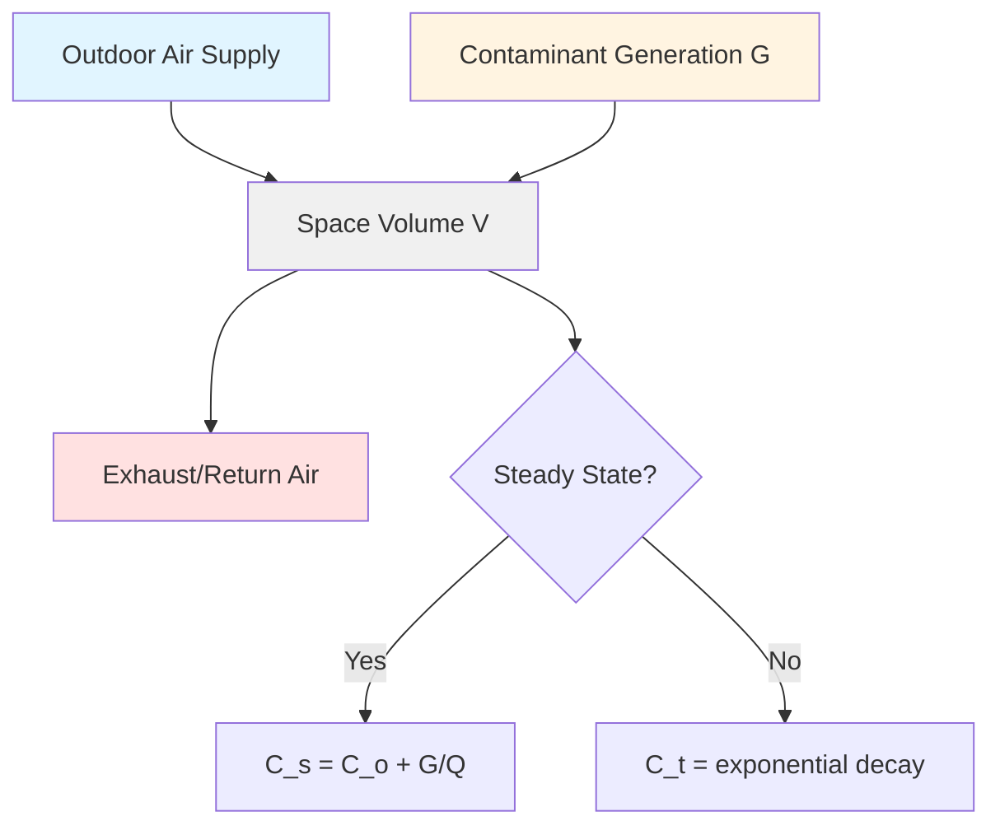
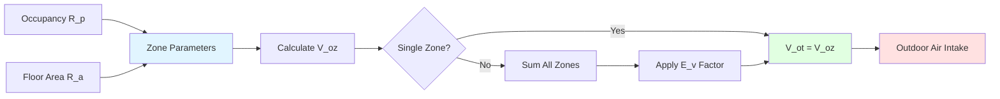

# Ventilation Principles and Fundamentals

Ventilation is the intentional delivery and removal of air to control indoor air quality, temperature, and humidity. Proper ventilation dilutes and removes airborne contaminants, providing acceptable indoor air quality while managing energy consumption.

## Fundamental Ventilation Mechanisms

Ventilation serves three primary functions:

- **Dilution of contaminants** generated by occupants, materials, and processes
- **Removal of heat** from internal gains and solar radiation
- **Moisture control** to maintain acceptable humidity levels

The effectiveness of ventilation depends on the interaction between outdoor air supply, air distribution patterns, and contaminant generation rates.

## Dilution Ventilation Theory

The steady-state dilution equation relates ventilation rate to contaminant concentration:

$$Q = \frac{G}{C_s - C_o}$$

Where:
- $Q$ = required ventilation rate (CFM or L/s)
- $G$ = contaminant generation rate (mass/time)
- $C_s$ = steady-state indoor concentration (mass/volume)
- $C_o$ = outdoor air concentration (mass/volume)

For time-dependent contaminant decay, the exponential relationship applies:

$$C(t) = C_o + (C_i - C_o) \cdot e^{-\frac{Qt}{V}}$$

Where:
- $C(t)$ = concentration at time $t$
- $C_i$ = initial indoor concentration
- $V$ = space volume (ft³ or m³)
- $t$ = time (hours or seconds)

This equation demonstrates that contaminant concentration approaches outdoor levels asymptotically, with the rate determined by air changes per hour ($ACH = Q/V$).

## Air Change Method

The air change method specifies ventilation as the number of complete air volume replacements per hour:

$$ACH = \frac{Q \times 60}{V}$$

For CFM and ft³, or:

$$ACH = \frac{Q \times 3600}{V}$$

For L/s and m³.

**Typical air change requirements:**

| Occupancy Type | ACH Range | Application |
|----------------|-----------|-------------|
| Residential | 0.35-1.0 | ASHRAE 62.2 minimum |
| Office spaces | 3-6 | General ventilation |
| Laboratories | 6-12 | Fume hood operation |
| Hospitals | 6-15 | Infection control |
| Industrial | 4-30 | Process-dependent |

The air change method is simple but does not account for occupant density, contaminant generation rates, or ventilation effectiveness.

## Ventilation Rate Procedure (ASHRAE 62.1)

ASHRAE Standard 62.1 establishes the Ventilation Rate Procedure (VRP), which calculates outdoor air requirements based on occupancy and floor area:

$$V_{oz} = R_p \times P_z + R_a \times A_z$$

Where:
- $V_{oz}$ = outdoor air requirement for zone (CFM)
- $R_p$ = outdoor air rate per person (CFM/person)
- $P_z$ = zone population (people)
- $R_a$ = outdoor air rate per unit area (CFM/ft²)
- $A_z$ = zone floor area (ft²)

For multiple-zone systems, the system outdoor air intake must account for ventilation efficiency:

$$V_{ot} = \frac{\sum V_{oz}}{E_v}$$

Where:
- $V_{ot}$ = total system outdoor air intake (CFM)
- $E_v$ = ventilation efficiency (typically 0.6-1.0)

## Ventilation Effectiveness

Ventilation effectiveness quantifies how efficiently delivered outdoor air reaches the breathing zone:

$$\epsilon = \frac{C_e - C_s}{C_e - C_{bz}}$$

Where:
- $\epsilon$ = ventilation effectiveness (dimensionless)
- $C_e$ = exhaust air concentration
- $C_s$ = supply air concentration
- $C_{bz}$ = breathing zone concentration

Perfect mixing yields $\epsilon = 1.0$. Displacement ventilation can achieve $\epsilon > 1.0$, while short-circuiting reduces effectiveness below 1.0.

## Air Distribution Patterns

Air movement patterns fundamentally affect ventilation performance:

```mermaid
graph TB
    subgraph "Mixing Ventilation"
    A1[High-velocity Supply] --> B1[Turbulent Mixing]
    B1 --> C1[Uniform Concentration]
    C1 --> D1[ε ≈ 1.0]
    end

    subgraph "Displacement Ventilation"
    A2[Low-velocity Supply] --> B2[Thermal Stratification]
    B2 --> C2[Lower Breathing Zone Conc.]
    C2 --> D2[ε > 1.0]
    end

    subgraph "Short-Circuiting"
    A3[Supply Near Return] --> B3[Direct Flow Path]
    B3 --> C3[Poor Distribution]
    C3 --> D3[ε < 1.0]
    end

    style D1 fill:#ffffcc
    style D2 fill:#ccffcc
    style D3 fill:#ffcccc
```

## Age of Air and Air Change Efficiency

The mean age of air characterizes how long air has been in a space:

$$\tau_n = \frac{\int_0^\infty t \cdot C(t) \, dt}{\int_0^\infty C(t) \, dt}$$

Air change efficiency relates actual performance to ideal plug flow:

$$\epsilon_a = \frac{\tau_n^{ideal}}{\tau_n^{actual}} = \frac{V/(2Q)}{\tau_n}$$

Higher air change efficiency indicates better ventilation performance for a given airflow rate.

## Practical Design Considerations

Effective ventilation design requires:

1. **Accurate load calculations** - Determine contaminant generation and occupancy patterns
2. **Appropriate air distribution** - Select supply and return configurations for intended effectiveness
3. **System balancing** - Ensure design airflow rates are achieved throughout the space
4. **Pressure relationships** - Maintain appropriate pressure differentials between zones
5. **Energy recovery** - Implement heat/energy recovery where economically justified

The choice between air change method and ventilation rate procedure depends on application complexity, regulatory requirements, and contaminant characteristics. The VRP provides superior accuracy for occupied spaces with variable loads, while the air change method remains valid for industrial applications with known emission rates.

Understanding these fundamental principles enables proper system design, troubleshooting of indoor air quality problems, and optimization of energy performance while maintaining acceptable conditions.
